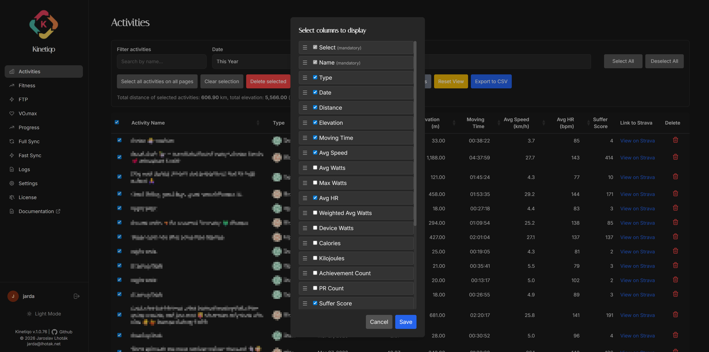
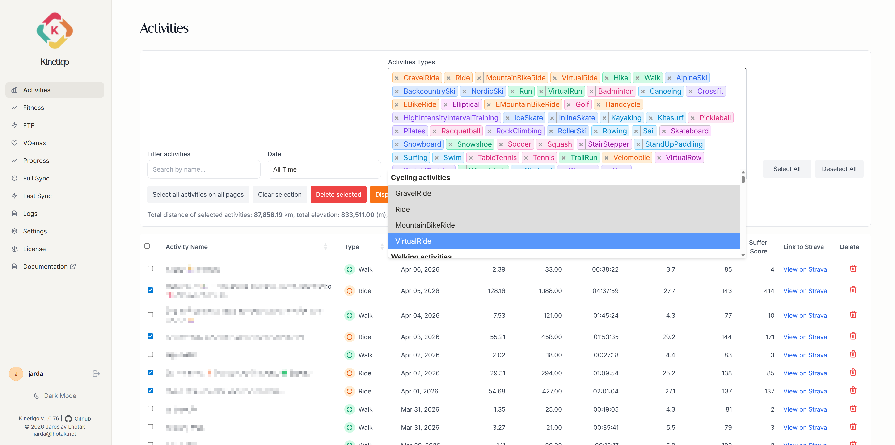
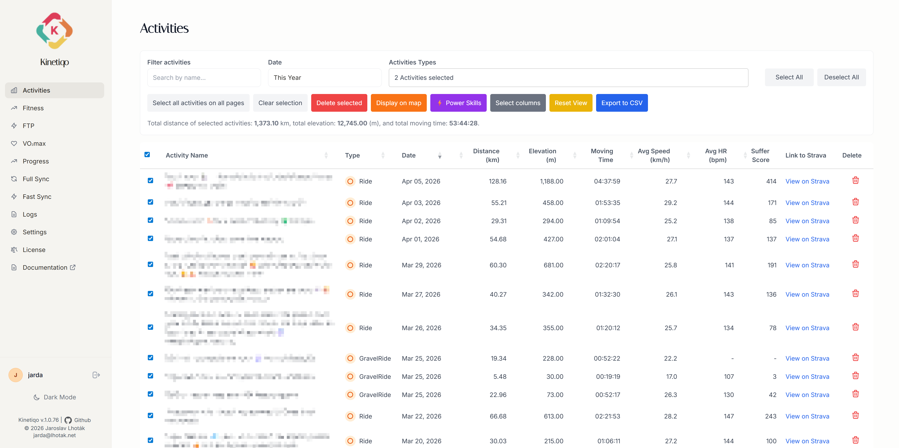
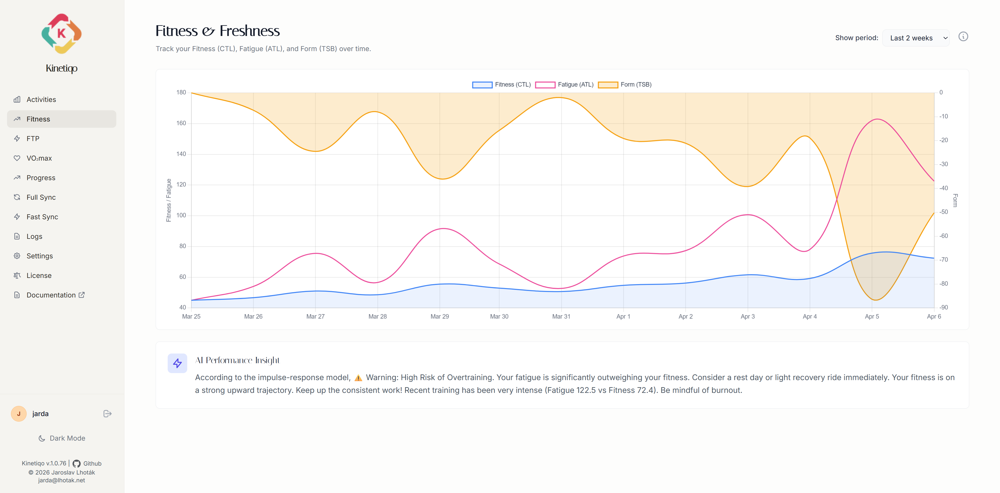
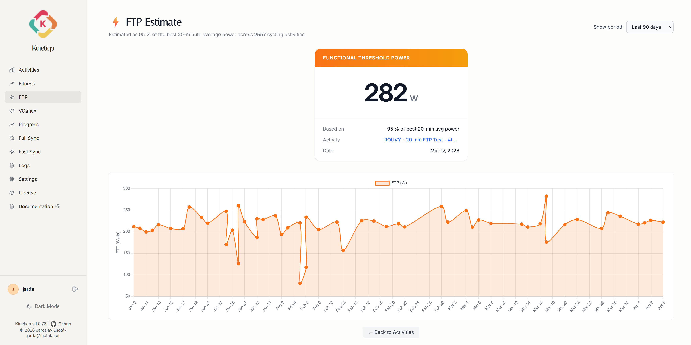
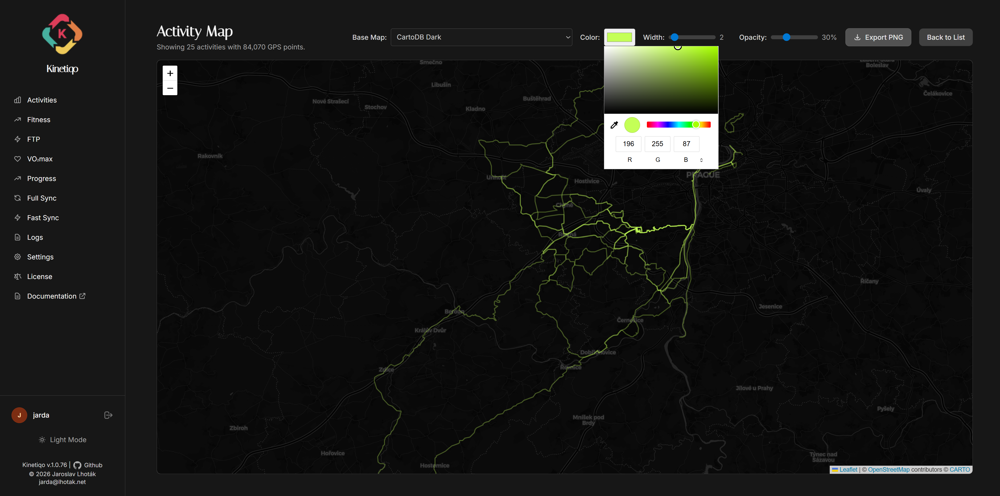
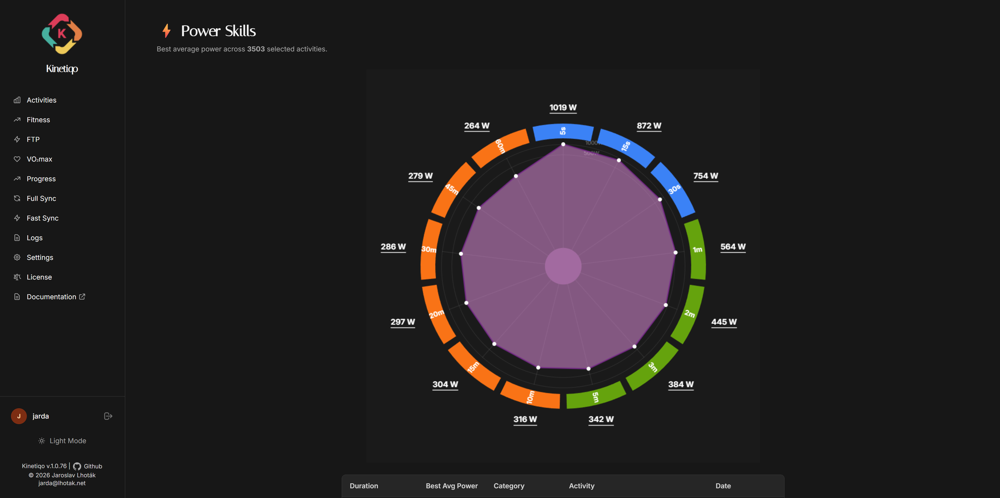
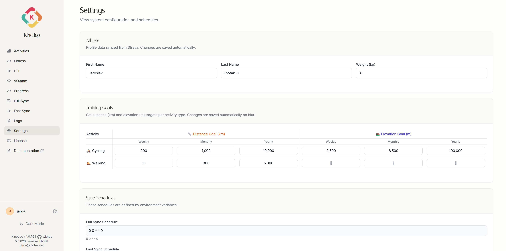
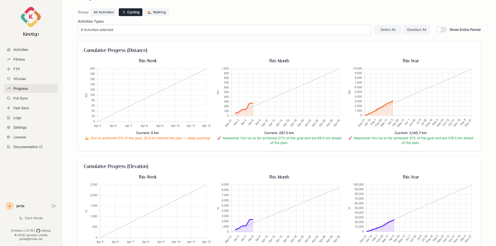
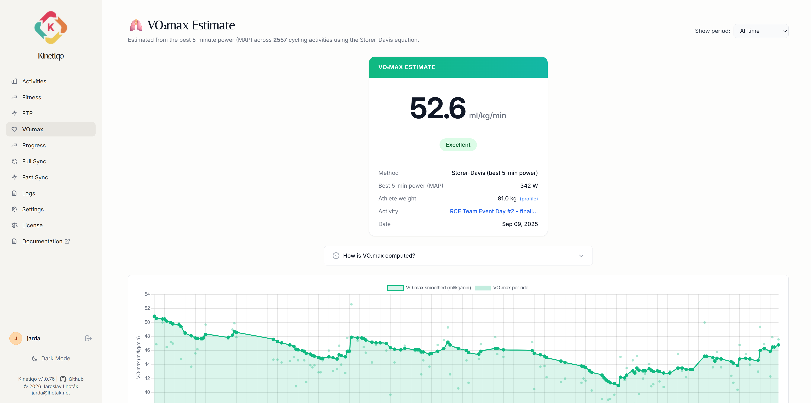

# Kinetiqo

[](https://sonarcloud.io/summary/new_code?id=lhotakj_kinetiqo) [](https://hub.docker.com/r/lhotakj/kinetiqo/tags)

Kinetiqo is a self-hosted data warehouse for your Strava activities. It synchronizes your data into a high-performance SQL database (**PostgreSQL**, **MySQL/MariaDB**, or **Firebird**), providing full ownership and control over your fitness history.

Visualize your progress with the **built-in Web UI** or integrate with your preferred business intelligence tools. For advanced analytics, Kinetiqo includes pre-configured **Grafana dashboards**, transforming your workout data into actionable insights.

> Full project documentation is available at [kinetiqo.lhotak.net](https://kinetiqo.lhotak.net) 

| [](docs/activities-colums-dark.png)<br/>activities-colums-dark.png | [](docs/activities-types.png)<br/>activities-types.png | [](docs/activities.png)<br/>activities.png |
|---|---|---|
| [](docs/fitness.png)<br/>fitness.png | [](docs/ftp.png)<br/>ftp.png | [](docs/map-dark.png)<br/>map-dark.png |
| [](docs/map.png)<br/>map.png | [](docs/power-dark.png)<br/>power-dark.png | [](docs/settings.png)<br/>settings.png |
| [](docs/trend.png)<br/>trend.png | [](docs/vo2.png)<br/>vo2.png |  |


## Table of Contents

- [Features](#features)
- [Web UI Pages](#web-ui-pages)
- [Getting Started](#getting-started)
  - [Dependencies](#dependencies)
  - [Local Setup](#local-setup)
  - [Configuration](#configuration)
    - [1. Strava API Credentials](#1-strava-api-credentials)
    - [2. Database Configuration](#2-database-configuration)
    - [3. Scheduling (Cron)](#3-scheduling-cron)
    - [4. Web Interface Configuration](#4-web-interface-configuration)
    - [5. Athlete Configuration](#5-athlete-configuration)
    - [6. Display Configuration](#6-display-configuration)
    - [7. Map Configuration](#7-map-configuration)
- [Command-Line Interface (CLI)](#command-line-interface-cli)
  - [CLI Commands](#cli-commands)
  - [Manual Sync](#manual-sync)
  - [Web Interface](#web-interface)
- [Architecture](#architecture)
  - [Project Structure](#project-structure)
  - [Technology Stack](#technology-stack)
- [Building Docker Images](#building-docker-images)
  - [Architecture: Two-Phase Build](#architecture-two-phase-build)
  - [Local Build](#local-build)
  - [CI/CD Workflows](#cicd-workflows)
- [Deployment](#deployment)
  - [Docker Run](#docker-run)
  - [Docker Compose](#docker-compose)
- [License](#license)
  - [Map Tile Attributions](#map-tile-attributions)

## Features

- 📊 **Advanced Visualization**: A streamlined web interface for daily monitoring and comprehensive Grafana dashboards for in-depth analysis.
- ⚡ **Power Skills Analysis**: Visualize your best power efforts across different time intervals (5s to 1h) with a spider chart, selectable per-activity or aggregated.
- 🏋️ **FTP Estimation**: Automatically estimates your Functional Threshold Power (95% of best 20-minute average power) from your recorded power-meter data, with a per-ride history chart.
- 🫁 **VO₂max Estimation**: Estimates your VO₂max from your best 5-minute MAP power using the Townsend method, including a smoothed history trend and classification band.
- 🏃 **Fitness & Freshness**: CTL / ATL / TSB chart calculated from suffer score, with configurable time constants.
- 🎯 **Activity Goals**: Set weekly, monthly, and yearly distance and elevation goals per activity type (Cycling, Running, Hiking, etc.) with progress tracking on the Settings page.
- 🗺️ **Interactive Maps**: View activities on an interactive Leaflet map with multiple tile providers (OpenStreetMap, Mapy.cz, Thunderforest, CARTO, Esri). Tiles are served through a server-side proxy that satisfies the OSM usage policy. Canvas renderer for performance with large datasets.
- 🌓 **Dark Mode Support**: Fully supported dark theme with automatic system preference detection and manual toggle.
- 📝 **Audit Logging**: Records all synchronization operations and data modifications, viewable in the Web UI.
- 🔄 **Intelligent Synchronization**:
  - **Full Synchronization**: Comprehensive audit of your Strava history — retrieves all activities and reconciles deletions.
  - **Incremental Synchronization**: Efficiently retrieves only the most recent activities.
  - **Real-time progress**: SSE-powered progress bar during sync operations via HTMX.
- 🐳 **Container-Native**: Dockerised on `python:3.13-alpine` with a two-phase build (Firebird base + app).
- ⏱️ **Automated Scheduling**: Built-in `dcron` scheduler for unattended sync.
- 💾 **Database Compatibility**:
  - **PostgreSQL** (version 12+)
  - **MySQL 8 / MariaDB 10+**
  - **Firebird** (versions 3.0, 4.0, 5.0)
- 🚀 **Response Compression**: All HTTP responses (HTML, JSON, static assets) are automatically compressed via `flask-compress` (gzip/brotli), reducing transfer sizes by 74–99%.
- 🔒 **Security**: OAuth 2.0 for Strava, `flask-login` session auth for the web UI.
- 🔔 **Version Check**: Asynchronous, cached check for new releases against GitHub.

---

## Web UI Pages

| Route | Page | Description |
|---|---|---|
| `/` | Dashboard | Redirects to Activities |
| `/activities` | Activities | Searchable, filterable activity list (DataTables 2.x) with bulk selection, delete, map, Power Skills, and CSV export actions |
| `/map` | Map | Interactive Leaflet map displaying selected activity GPS tracks with multiple tile layers |
| `/powerskills` | Power Skills | Spider chart of best average power over 5s, 30s, 1min, 5min, 10min, 20min, 1h durations |
| `/ftp` | FTP | FTP estimation history chart (95% of best 20-min power) |
| `/fitness` | Fitness & Freshness | CTL / ATL / TSB chart calculated from suffer score |
| `/vo2max` | VO₂max | VO₂max estimation from 5-min MAP power with trend and classification |
| `/settings` | Settings | Athlete profile, activity goals, application configuration |
| `/logs` | Logs | Audit log viewer for sync operations and data changes |
| `/license` | License | Open-source licenses, map tile attributions, and third-party credits |
| `/login` | Login | Session-based authentication |

### JSON API Endpoints

| Endpoint | Method | Description |
|---|---|---|
| `/api/activities` | GET | Activity list (supports filtering by type, date range) |
| `/api/activities` | DELETE | Bulk delete activities |
| `/api/activities/<id>` | DELETE | Delete single activity |
| `/api/map/data` | POST | GPS coordinate arrays for map rendering |
| `/api/fitness_data` | GET | CTL/ATL/TSB time series |
| `/api/ftp_history` | GET | FTP estimation history |
| `/api/vo2max_history` | GET | VO₂max estimation history |
| `/api/settings` | GET | Application settings |
| `/api/profile` | GET/PUT | Athlete profile (weight, name) |
| `/api/goals` | GET/PUT | Activity goals per type |

---

## Getting Started

### Dependencies

- Python 3.13+
- A running instance of PostgreSQL, MySQL/MariaDB, or Firebird.
- Python package dependencies as listed in `requirements.txt`.
- For Firebird, the client library is compiled from source inside the Docker base image (see [Building Docker Images](#building-docker-images)). For local (non-Docker) development on Ubuntu, install `libfbclient2`.

### Local Setup

1.  **Clone the Repository:**
    ```bash
    git clone https://github.com/lhotakj/kinetiqo.git
    cd kinetiqo
    ```
    
2.  **Install Firebird Client (Optional):**
    Required only if using Firebird as the database backend. Install on Ubuntu:
    ```bash
    sudo apt update
    sudo apt install -y libfbclient2
    ```

3.  **Initialize Virtual Environment:**
    ```bash
    python -m venv .venv
    source .venv/bin/activate  # On Windows, use `.venv\Scripts\activate`
    pip install -r requirements.txt
    ```

4.  **Environment Management with `direnv` (Optional):**
    The `development` directory contains a script to configure `direnv` for automated environment management.
    ```bash
    cd development
    ./setup-direnv.sh
    ```
    Upon configuration, `direnv` will automatically load the environment variables when entering the project directory.

5.  **Configure Environment Variables:**
    Create a `.env` file in the project root to define your configuration. This file is excluded from version control.
    
    **Example `.env` file:**
    ```env
    STRAVA_CLIENT_ID=12345
    STRAVA_CLIENT_SECRET=your_secret_here
    STRAVA_REFRESH_TOKEN=your_refresh_token_here
    DATABASE_TYPE=postgresql  # or mysql or firebird
    # PostgreSQL
    POSTGRESQL_HOST=localhost
    POSTGRESQL_PORT=5432
    POSTGRESQL_USER=postgres
    POSTGRESQL_PASSWORD=password
    POSTGRESQL_DATABASE=kinetiqo
    POSTGRESQL_SSL_MODE=disable
    # MySQL
    MYSQL_HOST=localhost
    MYSQL_PORT=3306
    MYSQL_USER=root
    MYSQL_PASSWORD=password
    MYSQL_DATABASE=kinetiqo
    MYSQL_SSL_MODE=disable
    # Firebird
    FIREBIRD_HOST=localhost
    FIREBIRD_PORT=3050
    FIREBIRD_USER=firebird
    FIREBIRD_PASSWORD=firebird
    FIREBIRD_DATABASE=/db/data/kinetiqo.fdb
    # API for Maps
    MAPY_API_KEY="abc123"
    THUNDERFOREST_API_KEY="abc456"

    ```
    - Set `DATABASE_TYPE` to `postgresql`, `mysql`, or `firebird` as needed.
    - Only the relevant database section is required for your selected type.

6.  **Secure Secret Storage with GPG (Optional):**
    For enhanced security, environment files can be encrypted using GPG. The included `.envrc` script supports automatic decryption.
    
    1. **Import GPG Key:**
       ```shell
       gpg --import ~/.ssh/id_rsa
       gpg --list-secret-keys
       ```

    2. **Encrypt Environment File:**
       The following command encrypts `.env.development`.
       ```shell
       mkdir -p secrets
       gpg -r <your-key-id> -o secrets/development.gpg -e .env.development
       ```
       Ensure the unencrypted source file (`.env.development`) is included in `.gitignore`.

### Configuration

Configuration is managed exclusively via environment variables.

#### 1. Strava API Credentials
Register an application in the [Strava API Settings](https://www.strava.com/settings/api) to obtain the necessary credentials.

| Variable | Description | Required |
|----------|-------------|----------|
| `STRAVA_CLIENT_ID` | Strava Application Client ID. | ✅ |
| `STRAVA_CLIENT_SECRET` | Strava Application Client Secret. | ✅ |
| `STRAVA_REFRESH_TOKEN` | Valid Refresh Token with `activity:read_all` scope. | ✅ |

#### 2. Database Configuration
Define `DATABASE_TYPE` as either `postgresql` (default), `mysql`, or `firebird`.

**PostgreSQL (Default):**

| Variable | Description | Default |
|----------|-------------|---------|
| `POSTGRESQL_HOST` | Database server hostname. | Required |
| `POSTGRESQL_PORT` | Database server port. Override via env var. | `5432` |
| `POSTGRESQL_USER` | Database username. | Required |
| `POSTGRESQL_PASSWORD` | Database password. | Required |
| `POSTGRESQL_DATABASE` | Database name. | Required |
| `POSTGRESQL_SSL_MODE` | SSL connection mode (`disable`, `require`, etc.). | `disable` |

**MySQL / MariaDB:**

| Variable | Description | Default |
|----------|-------------|---------|
| `MYSQL_HOST` | Database server hostname. | Required |
| `MYSQL_PORT` | Database server port. Override via env var. | `3306` |
| `MYSQL_USER` | Database username. | Required |
| `MYSQL_PASSWORD` | Database password. | Required |
| `MYSQL_DATABASE` | Database name. | Required |
| `MYSQL_SSL_MODE` | SSL connection mode. | `disable` |

> **Note:** For MySQL, ensure the user has `CREATE` and `ALL PRIVILEGES` on the target database to allow for schema management.

**Firebird:**

| Variable | Description | Default |
|----------|-------------|---------|
| `FIREBIRD_HOST` | Database server hostname. | Required |
| `FIREBIRD_PORT` | Database server port. Override via env var. | `3050` |
| `FIREBIRD_USER` | Database username. | Required |
| `FIREBIRD_PASSWORD` | Database password. | Required |
| `FIREBIRD_DATABASE` | Database file path or alias. | Required |

> **Note:** Kinetiqo will automatically create the Firebird database and schema if they don't exist. 
> 
> **Version Compatibility:** Tested and fully compatible with Firebird 3.0, 4.0, and 5.0. Uses only standard SQL features available in all these versions (SEQUENCE, TRIGGER, UPDATE OR INSERT, FIRST/SKIP pagination).
> 
> **Permissions Required:**
> - The user must have rights to **create databases** on the Firebird server (typically `SYSDBA` or a user with equivalent privileges)
> - Once the database exists, the user needs rights to **create tables, sequences, triggers, and indexes**
> - For embedded Firebird, ensure the application has **write access** to the database file directory

#### 3. Scheduling (Cron)
The Docker image includes a built-in cron scheduler powered by `dcron`. When the container starts, the entrypoint script registers cron jobs for any sync schedules you define via environment variables. If neither variable is set, no automatic synchronization occurs.

| Variable | Description | Example |
|----------|-------------|---------|
| `FULL_SYNC` | Schedule for full synchronization. | `0 3 * * *` (Daily at 3 AM) |
| `FAST_SYNC` | Schedule for incremental synchronization. | `*/15 * * * *` (Every 15 minutes) |

Both variables accept standard **5-field cron expressions** (`minute hour day-of-month month day-of-week`):

| Field | Allowed Values |
|-------|---------------|
| Minute | `0–59` |
| Hour | `0–23` |
| Day of month | `1–31` |
| Month | `1–12` |
| Day of week | `0–7` (0 and 7 = Sunday) |

**How the two sync modes differ:**

- **`FAST_SYNC`** runs an incremental sync (`--fast-sync`). It only fetches activities newer than the most recent one already in the database. This is lightweight and ideal for frequent scheduling (e.g., every 15 minutes) to keep data nearly real-time.
- **`FULL_SYNC`** runs a comprehensive audit (`--full-sync`). It retrieves your entire Strava activity history, inserts any missing activities, and removes any that were deleted on Strava. This is heavier and best scheduled infrequently (e.g., once daily during off-hours).

**Recommended setup:** Use both together — `FAST_SYNC` for frequent, low-cost updates and `FULL_SYNC` as a daily reconciliation pass.

**Common cron examples:**

| Expression | Meaning |
|-----------|---------|
| `*/15 * * * *` | Every 15 minutes |
| `0 * * * *` | Every hour, on the hour |
| `0 3 * * *` | Daily at 3:00 AM |
| `0 3 * * 0` | Weekly on Sunday at 3:00 AM |
| `0 */6 * * *` | Every 6 hours |

#### 4. Web Interface Configuration
| Variable | Description | Default |
|----------|-------------|---------|
| `WEB_LOGIN` | Username for web access. | `admin` |
| `WEB_PASSWORD` | Password for web access. | `admin123` |

#### 5. Athlete Configuration
| Variable | Description | Default |
|----------|-------------|---------|
| `ATHLETE_WEIGHT` | Athlete body weight in kilograms, used for VO₂max estimation. This is a **fallback only** — the primary source is the Strava profile (synced automatically) or the **Settings → Athlete** page in the Web UI. | `0` (not set) |

#### 6. Display Configuration
| Variable | Description | Default |
|----------|-------------|---------|
| `DATE_FORMAT` | Date format string (Python `strftime` syntax). | `%b %d, %Y` |

#### 7. Map Configuration

Kinetiqo ships with **8 map tile layers** from 5 providers. Two providers (Mapy.cz and Thunderforest) require a free API key; the rest work out of the box.

| Variable | Description | Default |
|----------|-------------|---------|
| `MAPY_API_KEY` | API key for Mapy.cz tile layers (Basic & Outdoor). | _(empty)_ |
| `THUNDERFOREST_API_KEY` | API key for Thunderforest tile layers (OpenCycleMap & Outdoors). | _(empty)_ |

**Available map layers:**

| # | Layer Name | Provider | API Key Required | Max Zoom | Best For |
|---|---|---|---|---|---|
| 1 | **OpenStreetMap** | OpenStreetMap | No | 19 | General use (default) |
| 2 | **Mapy.cz (Basic)** | Seznam.cz | `MAPY_API_KEY` | 19 | Detailed Czech/European maps |
| 3 | **Mapy.cz (Outdoor)** | Seznam.cz | `MAPY_API_KEY` | 19 | Hiking & outdoor trails |
| 4 | **Thunderforest (OpenCycleMap)** | Thunderforest | `THUNDERFOREST_API_KEY` | 22 | Cycling routes, bike infrastructure |
| 5 | **Thunderforest (Outdoors)** | Thunderforest | `THUNDERFOREST_API_KEY` | 22 | Hiking, contours, terrain |
| 6 | **CartoDB Positron** | CARTO | No | 20 | Minimalist light basemap |
| 7 | **CartoDB Dark** | CARTO | No | 20 | Dark theme basemap |
| 8 | **Esri World Imagery** | Esri | No | 18 | Satellite imagery |

> Layers that require a missing API key appear **greyed-out** in the map selector with a hint. They are not removed — just disabled until the key is configured.

**How to get API keys:**

| Provider | Free Tier | How to Get the Key |
|---|---|---|
| **Mapy.cz** (Seznam.cz) | Up to 250,000 credits/month for non-commercial / personal use | 1. Go to [developer.mapy.com](https://developer.mapy.com) → 2. Register or sign in with a Seznam account → 3. Create a new project → 4. Copy the API key → 5. Set `MAPY_API_KEY` env var |
| **Thunderforest** | Up to 150,000 tiles/month for hobby / personal projects | 1. Go to [manage.thunderforest.com/signup](https://manage.thunderforest.com/signup) → 2. Register for a free "Hobby Project" account → 3. Copy the API key from the dashboard → 4. Set `THUNDERFOREST_API_KEY` env var |

> **OSM tile proxy:** OpenStreetMap tiles are served through a built-in server-side proxy (`/tiles/osm/...`) so the browser never contacts `tile.openstreetmap.org` directly. This satisfies the [OSM Tile Usage Policy](https://operations.osmfoundation.org/policies/tiles/) by attaching a proper `User-Agent` and `Referer` header from the server.

> **Note:** Synchronization errors are recorded in the `logs` database table and are accessible via the Web UI or `docker logs`.

## Command-Line Interface (CLI)

The CLI tool is located in the `src` directory.

### CLI Commands

-   `--database` / `-d`: Selects the database backend (`mysql`, `postgresql`, or `firebird`), overriding environment variables.
-   `sync`: Initiates data synchronization.
    -   `--full-sync` / `-f`: Executes a full synchronization audit.
    -   `--fast-sync` / `-q`: Executes an incremental synchronization.
    -   `--period` / `-p`: Restricts full synchronization to a specific timeframe (e.g., '7d', '2w', '1m', '1y').
    -   `--enable-strava-cache`: Activates API response caching.
    -   `--cache-ttl`: Defines cache time-to-live in minutes (default: 60).
    -   `--clear-cache`: Purges the cache prior to synchronization.
-   `web`: Launches the web server.
    -   `--port`: Specifies the listening port (default: 4444).
    -   `--host`: Specifies the bind address (default: 0.0.0.0).
-   `flightcheck`: Validates database connectivity and schema integrity.
-   `version`: Outputs the current version information.

### Manual Sync

Execute the `sync` command from the `src` directory:

```bash
# Execute full synchronization
python kinetiqo.py sync --full-sync

# Execute full synchronization limited to the last 30 days
python kinetiqo.py sync --full-sync --period 30d

# Execute incremental synchronization
python kinetiqo.py sync --fast-sync
```

### Web Interface

Launch the web server using the `web` command:

```bash
# Start server on default port (4444)
python kinetiqo.py web

# Start server on custom port with specific database backend
python kinetiqo.py --database mysql web --port 8000
```

## Architecture

### Project Structure

```
src/
├── kinetiqo.py                 # CLI entry point (Click)
├── app.py                      # Alternative WSGI entry point
└── kinetiqo/                   # Core application package
    ├── __init__.py
    ├── __main__.py
    ├── cache.py                 # Strava API response cache
    ├── cli.py                   # Click CLI commands (sync, web, flightcheck, version)
    ├── config.py                # Config dataclass (reads env vars)
    ├── strava.py                # Strava API client (OAuth2, activity streams)
    ├── sync.py                  # SyncService (core sync logic, SSE progress)
    ├── version_check.py         # Async GitHub release version check
    ├── db/
    │   ├── repository.py        # DatabaseRepository ABC (contract for all backends)
    │   ├── factory.py           # create_repository() factory
    │   ├── schema.py            # DDL schema definitions
    │   ├── postgresql.py        # PostgreSQL implementation
    │   ├── mysql.py             # MySQL/MariaDB implementation
    │   └── firebird.py          # Firebird implementation
    └── web/
        ├── app.py               # Flask app, all routes & API endpoints
        ├── auth.py              # flask-login User model & auth helpers
        ├── fitness.py           # CTL/ATL/TSB calculation (pandas)
        ├── vo2max.py            # VO₂max estimation (Townsend method)
        ├── progress.py          # SSE sync progress stream
        ├── static/              # Static assets (CSS, JS, images)
        └── templates/           # Jinja2 templates
            ├── base.html            # Base layout (sidebar, dark mode, CDN imports)
            ├── activities.html      # Activity list (DataTables, Select2, DateRangePicker)
            ├── map.html             # Leaflet map with multi-provider tile layers
            ├── powerskills.html     # Power Skills spider chart (Chart.js)
            ├── ftp.html             # FTP estimation history chart
            ├── fitness.html         # Fitness & Freshness chart (CTL/ATL/TSB)
            ├── vo2max.html          # VO₂max estimation chart
            ├── settings.html        # Settings page (profile, goals, config)
            ├── logs.html            # Audit log viewer
            ├── license.html         # License & attribution page
            ├── login.html           # Login form
            ├── sync.html            # Sync trigger page
            ├── progress.html        # SSE progress bar
            └── _*.html              # Reusable partials (filters, selectors)
tests/
├── test_sync_logic.py           # Canonical mocked unit test example
├── test_cli_sync.py             # CLI sync command tests
├── test_ftp.py                  # FTP estimation tests
├── test_vo2max.py               # VO₂max estimation tests
├── test-docker-postgresql.sh    # Docker integration test (PostgreSQL)
├── test-docker-mysql.sh         # Docker integration test (MySQL)
└── test-docker-firebird.sh      # Docker integration test (Firebird)
build/
├── Dockerfile                   # Application image (Phase 2)
├── Dockerfile.firebird-base     # Firebird base image (Phase 1)
├── build.sh                     # Local app image build script
├── build-base.sh                # Local base image build script
├── entrypoint.sh                # Container entrypoint (cron setup, Gunicorn)
└── docker-overview.md           # Docker build documentation
```

### Technology Stack

| Concern | Technology | Version |
|---|---|---|
| Language | Python | 3.13 |
| Web framework | Flask[async] + flask-login | 3.1.3 / 0.6.3 |
| Response compression | flask-compress | 1.24 |
| WSGI server | Gunicorn | 25.3.0 |
| CLI | Click | 8.3.2 |
| HTTP client | httpx | 0.28.1 |
| Data processing | pandas | 3.0.2 |
| Versioning | packaging | 26.0 |
| PostgreSQL driver | psycopg2-binary | 2.9.11 |
| MySQL driver | mysql-connector-python | 9.6.0 |
| Firebird driver | firebird-driver | 2.0.2 |
| Frontend CSS | Tailwind CSS | CDN (play) |
| Reactivity | HTMX + htmx-ext-sse | 2.0.4 / 2.2.2 |
| Data tables | DataTables + Buttons + ColReorder | 2.3.7 / 3.2.6 / 2.1.2 |
| Charting | Chart.js + chartjs-adapter-moment | 4.x / 1.0 |
| Maps | Leaflet.js | 1.9 |
| Dropdowns | Select2 | 4.1 |
| Date pickers | DateRangePicker + Moment.js | latest / 2.30 |
| Drag & drop | SortableJS | 1.15 |
| Fonts | Inter (variable), Italiana | Google Fonts |
| Container base | python:3.13-alpine | — |
| Scheduler | dcron | Alpine package |
| Testing | unittest + unittest.mock | stdlib |

## Building Docker Images

### Architecture: Two-Phase Build

The Docker build is split into **two independent phases** to keep day-to-day builds fast. Compiling the Firebird 5.x client library from source takes ~40 minutes on CI, so it is isolated into a dedicated **base image** that rarely needs rebuilding.

```
Phase 1 (rare)                          Phase 2 (every release)
┌──────────────────────────┐            ┌──────────────────────────┐
│  Dockerfile.firebird-base│            │  Dockerfile              │
│                          │            │                          │
│  python:3.13-alpine      │            │  python:3.13-alpine      │ ← pip install only
│    + compile Firebird    │            │    (builder stage)       │
│    + runtime libs        │            │                          │
│           ↓              │            │  lhotakj/firebird-python │ ← FROM base image
│  lhotakj/firebird-python │ ──────────│    + pip packages        │
│         :3.13            │  used as   │    + app source          │
└──────────────────────────┘  base      │           ↓              │
                                        │  lhotakj/kinetiqo:x.y.z │
                                        └──────────────────────────┘
```

| Phase | Image | Dockerfile | Rebuild when… |
|---|---|---|---|
| 1 — Base | `lhotakj/firebird-python:3.13` | `build/Dockerfile.firebird-base` | Python or Firebird version changes |
| 2 — App | `lhotakj/kinetiqo:x.y.z` | `build/Dockerfile` | Application code or dependencies change |

### Local Build

Both phases can be run entirely locally without pushing anything to Docker Hub.

```bash
# Phase 1 — build the base image (~40 min, one-time)
cd build
./build-base.sh

# Phase 2 — build the application image (~2 min)
./build.sh
```

`build-base.sh` compiles the Firebird client and loads `lhotakj/firebird-python:3.13` into your local Docker daemon. `build.sh` then uses that local image as its `FROM` target (with `--pull=false` to prevent Docker from reaching out to Docker Hub).

You only need to re-run `build-base.sh` when you change the Python or Firebird version. For day-to-day code changes, `./build.sh` alone is sufficient.

Both scripts accept the `--push` flag to publish to Docker Hub instead:

| Script | Without `--push` | With `--push` |
|---|---|---|
| `build-base.sh` | Builds for `linux/amd64`, loads locally | Builds for `linux/amd64` + `linux/arm64`, pushes to DockerHub |
| `build.sh` | Builds for `linux/amd64`, loads locally | Builds for `linux/amd64` + `linux/arm64`, pushes to DockerHub |

`build-base.sh` also accepts `--python <version>` and `--firebird <version>` to override the defaults (`3.13` and `5.0.3`).

### CI/CD Workflows

Two GitHub Actions workflows mirror the two-phase build:

| Workflow | File | Trigger | Purpose |
|---|---|---|---|
| **Build Firebird Python Base Image** | `.github/workflows/build-base-image.yaml` | Manual (`workflow_dispatch`) | Compiles Firebird, pushes `lhotakj/firebird-python` to DockerHub |
| **Build and publish Docker image** | `.github/workflows/build.yaml` | Manual or push to `main` with `/publish` or `/release` in commit message | Builds the app image, optionally pushes to DockerHub and creates a GitHub Release |

#### Build Firebird Python Base Image

Triggered **manually only** from the GitHub Actions UI. Inputs:

| Input | Default | Description |
|---|---|---|
| `python_version` | `3.13` | Python version for the base Alpine image |
| `firebird_version` | `5.0.3` | Firebird version to compile from source |
| `platforms` | `linux/amd64,linux/arm64` | Target architectures |

Pushes two tags to DockerHub:
- `lhotakj/firebird-python:3.13`
- `lhotakj/firebird-python:3.13-firebird5.0.3`

#### Build and publish Docker image

Triggered **manually** (with `publish` and `create_release` boolean inputs) or automatically on push to `main` when the commit message contains `/publish` and/or `/release`.

| Commit commands | Effect |
|---|---|
| `/publish` | Build and push the Docker image to DockerHub |
| `/release` | Create a GitHub Release with an auto-generated changelog |

## Deployment

### Docker Run

Example command to deploy Kinetiqo as a standalone container with PostgreSQL as database and providing API keys for mapy.com and thunderforest.com maps:

```bash
docker run -d \
  --name kinetiqo \
  -p 8080:4444 \
  -e STRAVA_CLIENT_ID="your_id" \
  -e STRAVA_CLIENT_SECRET="your_secret" \
  -e STRAVA_REFRESH_TOKEN="your_token" \
  -e DATABASE_TYPE="postgresql" \
  -e POSTGRESQL_HOST="host.docker.internal" \
  -e POSTGRESQL_PORT=5432 \
  -e POSTGRESQL_USER="postgres" \
  -e POSTGRESQL_PASSWORD="password" \
  -e POSTGRESQL_DATABASE="kinetiqo" \
  -e MAPY_API_KEY="your_mapy_com_api_token" \
  -e THUNDERFOREST_API_KEY="your_thunderforest_api_token" \
  -e FAST_SYNC="*/15 * * * *" \
  -e FULL_SYNC="0 3 * * *" \
  -e WEB_LOGIN="admin" \
  -e WEB_PASSWORD="securepassword13" \
  lhotakj/kinetiqo:latest
```

- Set `DATABASE_TYPE` and only the relevant database variables for your chosen backend (`postgresql`, `mysql`, or `firebird`).
- The web UI will be available at http://localhost:8080

**Cron schedule in this example:**

| Variable | Value | Effect |
|----------|-------|--------|
| `FAST_SYNC` | `*/15 * * * *` | Runs an incremental sync every 15 minutes — quickly picks up any new activities recorded on Strava. |
| `FULL_SYNC` | `0 3 * * *` | Runs a full audit every day at 3:00 AM — reconciles all activities and detects deletions on Strava. |

Both schedules are optional. If omitted, no automatic sync occurs and you would need to trigger syncs manually via the Web UI or CLI.

### Docker Compose

For a production-grade deployment, use Docker Compose. The following configuration includes PostgreSQL and Grafana. You can adapt for MySQL or Firebird as needed.

**`docker-compose.yml`:**

```yaml
services:
  kinetiqo:
    image: lhotakj/kinetiqo:latest
    container_name: kinetiqo
    restart: always
    ports:
      - "80:4444"
    environment:
      - STRAVA_CLIENT_ID=${STRAVA_CLIENT_ID}
      - STRAVA_CLIENT_SECRET=${STRAVA_CLIENT_SECRET}
      - STRAVA_REFRESH_TOKEN=${STRAVA_REFRESH_TOKEN}
      - DATABASE_TYPE=postgresql  # or mysql or firebird
      - POSTGRESQL_HOST=postgresql
      - POSTGRESQL_PORT=5432
      - POSTGRESQL_USER=postgres
      - POSTGRESQL_PASSWORD=${POSTGRESQL_PASSWORD}
      - POSTGRESQL_DATABASE=kinetiqo
      - MAPY_API_KEY="${MAPY_API_KEY}"
      - THUNDERFOREST_API_KEY="${THUNDERFOREST_API_KEY}"
      - FAST_SYNC="*/15 * * * *"
      - FULL_SYNC="0 3 * * *"
      - WEB_LOGIN=admin
      - WEB_PASSWORD="${KINETIQO_WEB_PASSWORD}"
    depends_on:
      - postgresql
  postgresql:
    image: postgres:latest
    container_name: postgresql
    restart: always
    environment:
      - POSTGRES_USER=postgres
      - POSTGRES_PASSWORD=${POSTGRESQL_PASSWORD}
      - POSTGRES_DB=kinetiqo
    volumes:
      - postgresql_data:/var/lib/postgresql/data
  grafana:
    image: grafana/grafana:latest
    container_name: grafana
    restart: always
    ports:
      - "3000:3000"
    environment:
      - GF_SECURITY_ADMIN_PASSWORD=${GRAFANA_ADMIN_PASSWORD}
    depends_on:
      - postgresql
volumes:
  postgresql_data:
```

For MySQL or Firebird, replace the `postgresql` service and environment variables accordingly.

Create a `.env` file in the same directory:

```env
STRAVA_CLIENT_ID=your_strava_client_id
STRAVA_CLIENT_SECRET=your_strava_client_secret
STRAVA_REFRESH_TOKEN=your_strava_refresh_token
POSTGRESQL_PASSWORD=your_secure_password
GRAFANA_ADMIN_PASSWORD=your_grafana_admin_password
MAPY_API_KEY=your_mapy_com_api_token
THUNDERFOREST_API_KEY=your_thunderforest_api_token
KINETIQO_WEB_PASSWORD=your_password_for_web_interface
```

Deploy the stack:

```bash
docker-compose up -d
```

- For more details and advanced configuration, see the project documentation at [kinetiqo.lhotak.net](https://kinetiqo.lhotak.net).

## License

This project is licensed under the MIT License. See the [LICENSE](LICENSE) file for details.

### Map Tile Attributions

Kinetiqo displays map tiles from the following third-party providers. Their respective licenses and required attributions are listed below.

| Provider | License / Terms | Required Attribution |
|----------|----------------|----------------------|
| [OpenStreetMap](https://www.openstreetmap.org) | Data: [ODbL 1.0](https://opendatacommons.org/licenses/odbl/) · Tiles: [CC BY-SA 2.0](https://creativecommons.org/licenses/by-sa/2.0/) · [Tile Usage Policy](https://operations.osmfoundation.org/policies/tiles/) | © OpenStreetMap contributors |
| [Mapy.cz](https://mapy.com) (Seznam.cz, a.s.) | [Mapy.cz Developer Terms & Conditions](https://developer.mapy.com/terms-and-conditions/) — free tier for non-commercial / personal use; map data may not be used for competing map services | © Seznam.cz, a.s. · © OpenStreetMap |
| [Thunderforest](https://www.thunderforest.com/) | [Thunderforest Terms](https://www.thunderforest.com/terms/) — free tier available for low-traffic / personal use | Maps © Thunderforest · Data © OpenStreetMap contributors |
| [CARTO](https://carto.com/) (Positron & Dark Matter) | [CC BY 3.0](https://creativecommons.org/licenses/by/3.0/) | © OpenStreetMap contributors · © CARTO |
| [Esri World Imagery](https://www.esri.com/) | [Esri Master License Agreement](https://www.esri.com/en-us/legal/terms/full-master-agreement) | © Esri, Maxar, Earthstar Geographics |

For API key setup instructions, see [Map Configuration](#7-map-configuration) above.

