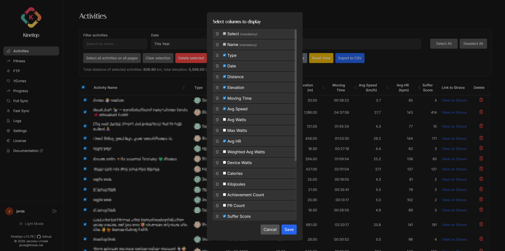
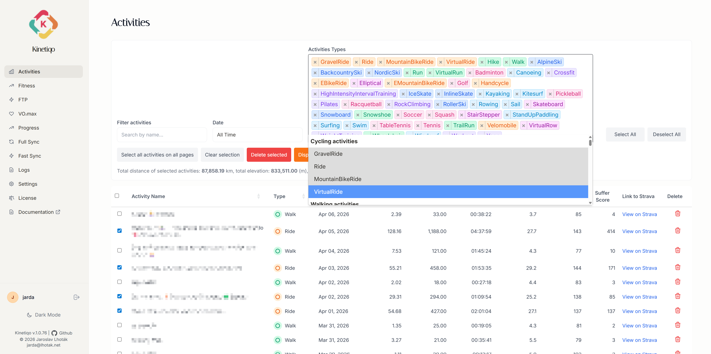
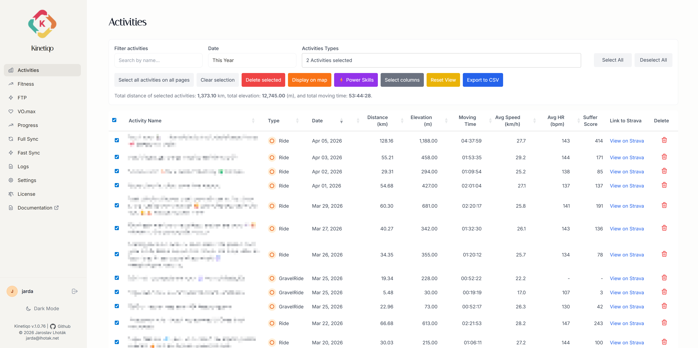
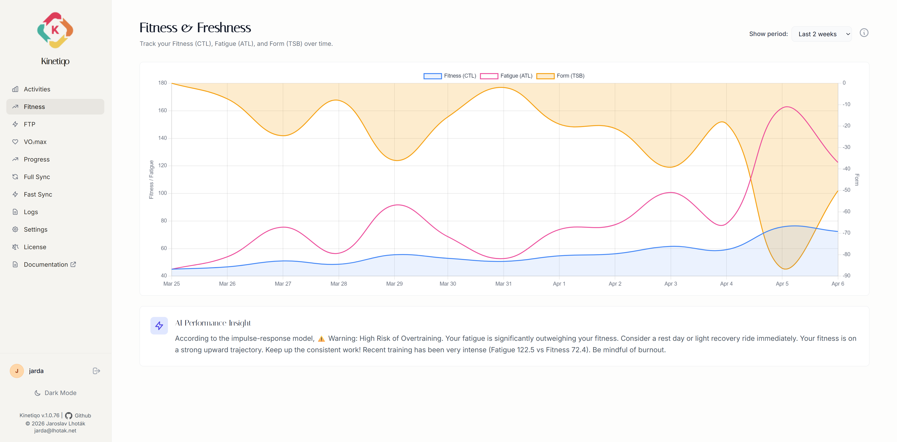
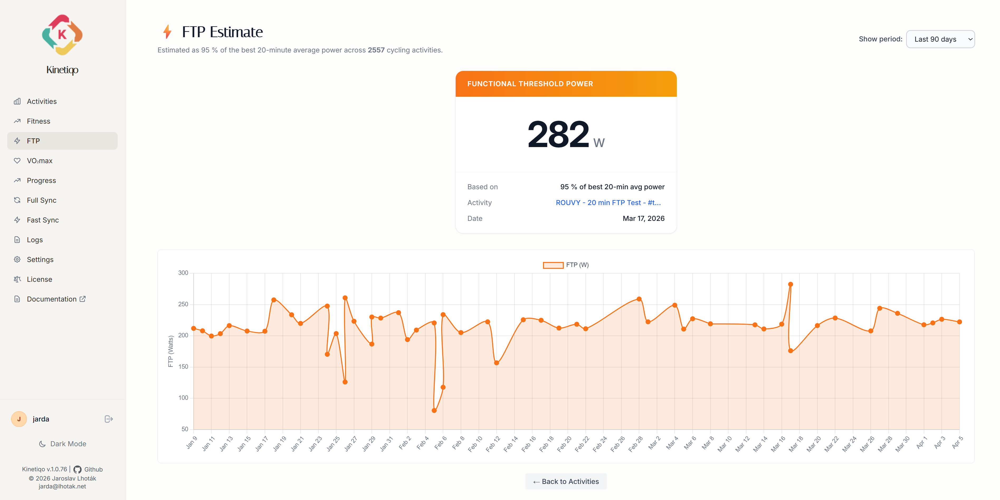
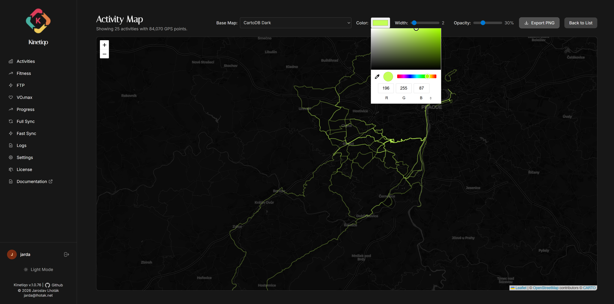
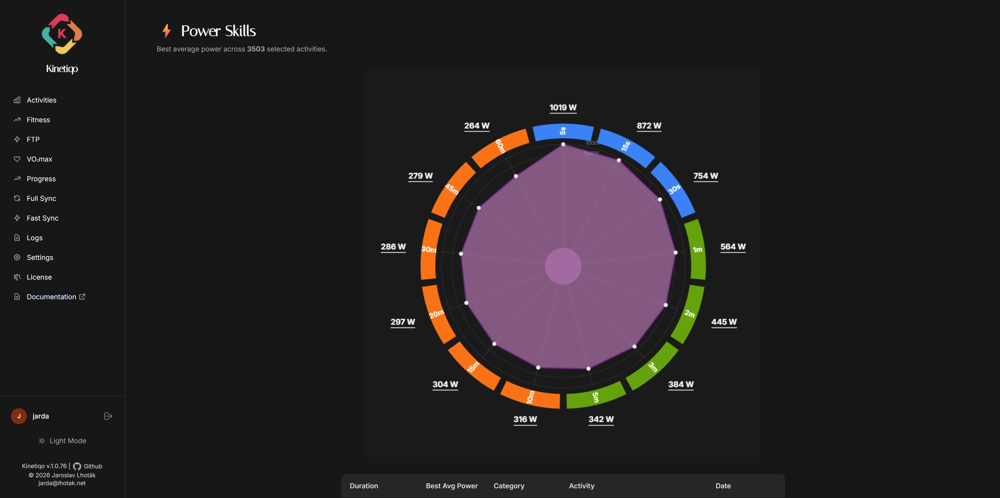
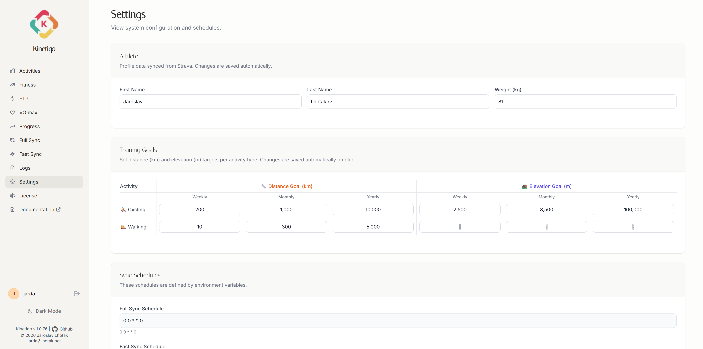
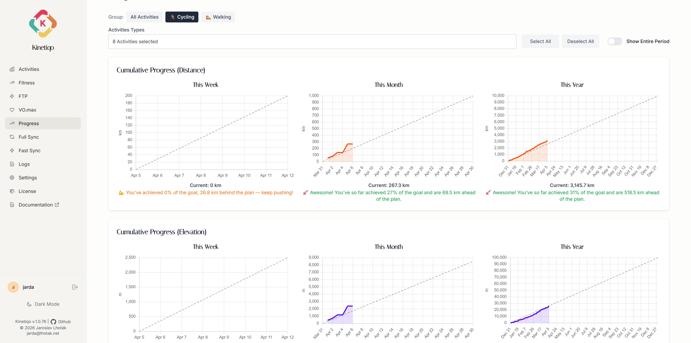
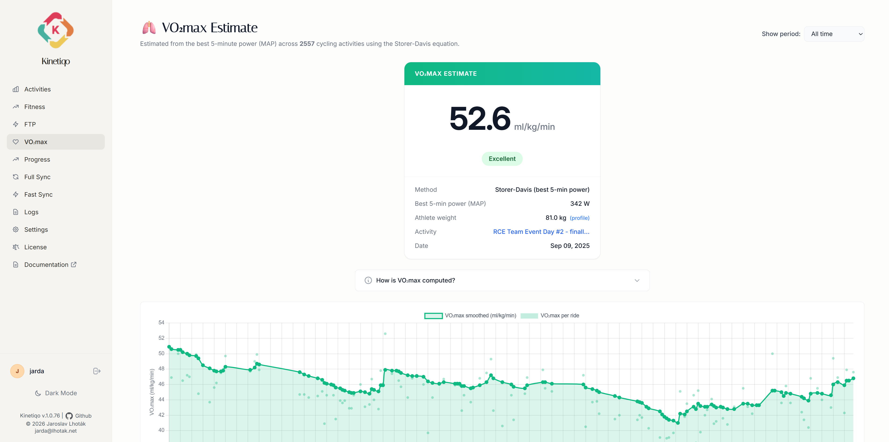

# Kinetiqo

<!-- Badges: SonarCloud (main branch), Docker Hub pulls, Python version -->
[](https://sonarcloud.io/project/overview?id=lhotakj_kinetiqo)
[](https://hub.docker.com/r/lhotakj/kinetiqo)
[](https://www.python.org/)
</img>


</img>

Kinetiqo is a self-hosted data warehouse for your Strava activities. It synchronizes your data into a high-performance SQL database (**PostgreSQL**, **MySQL/MariaDB**, or **Firebird**), providing full ownership and control over your fitness history.

Visualize your progress with the **built-in Web UI** or integrate with your preferred business intelligence tools. For advanced analytics, Kinetiqo includes pre-configured **Grafana dashboards**, transforming your workout data into actionable insights.

> Full project documentation is available at [kinetiqo.lhotak.net](https://kinetiqo.lhotak.net) 

| [](docs/activities-colums-dark.png)<br/>activities-colums-dark.png | [](docs/activities-types.png)<br/>activities-types.png | [](docs/activities.png)<br/>activities.png |
|---|---|---|
| [](docs/fitness.png)<br/>fitness.png | [](docs/ftp.png)<br/>ftp.png | [](docs/map-dark.png)<br/>map-dark.png |
| [](docs/map.png)<br/>map.png | [](docs/power-dark.png)<br/>power-dark.png | [](docs/settings.png)<br/>settings.png |
| [](docs/trend.png)<br/>trend.png | [](docs/vo2.png)<br/>vo2.png |  |


## Table of Contents

- [Features](#features)
- [Web UI Pages](#web-ui-pages)
- [Getting Started](#getting-started)
  - [Dependencies](#dependencies)
  - [Local Setup](#local-setup)
  - [Configuration](#configuration)
    - [1. Strava API Credentials](#1-strava-api-credentials)
    - [2. Database Configuration](#2-database-configuration)
    - [3. Scheduling (Cron)](#3-scheduling-cron)
    - [4. Logging Configuration](#4-logging-configuration)
    - [5. Web Interface Configuration](#5-web-interface-configuration)
    - [6. Athlete Configuration](#6-athlete-configuration)
    - [7. Display Configuration](#7-display-configuration)
    - [8. Map Configuration](#8-map-configuration)
    - [9. Strava Description Auto-Update (`UPDATE_STRAVA_*`)](#9-strava-description-auto-update-update_strava_)
- [Command-Line Interface (CLI)](#command-line-interface-cli)
  - [CLI Commands](#cli-commands)
  - [Manual Sync](#manual-sync)
  - [Web Interface](#web-interface)
- [Architecture](#architecture)
  - [Project Structure](#project-structure)
  - [Technology Stack](#technology-stack)
- [Building Docker Images](#building-docker-images)
  - [Architecture: Two-Phase Build](#architecture-two-phase-build)
  - [Local Build](#local-build)
  - [CI/CD Workflows](#cicd-workflows)
- [Deployment](#deployment)
  - [Docker Run](#docker-run)
  - [Docker Compose](#docker-compose)
- [License](#license)
  - [Map Tile Attributions](#map-tile-attributions)
- [Benchmark of databases](#benchmark-of-databases)

## Features

- 📊 **Advanced Visualization**: A streamlined web interface for daily monitoring and comprehensive Grafana dashboards for in-depth analysis.
- 📈 **MEGA Stats Infographic**: Generate Veloviewer-style infographics showcasing year/period statistics with activity calendar heatmaps, selectable by year, half-year, quarter, and activity type. The left stats column width, title font size, and activity group are persisted in the browser, and the displayed dates follow `DATE_FORMAT`. Export as PNG or PDF.
- 📸 **Activity Poster Generator**: Create professional activity posters with customizable fonts, colors, layouts (4:3, 16:9, 1:1 ratios), and sizes (800px–2048px width). Features live WYSIWYG preview, elevation chart, and Playwright-powered PNG export at exact pixel dimensions.
- ⚡ **Power Skills Analysis**: Visualize your best power efforts across different time intervals (5s to 1h) with a spider chart, selectable per-activity or aggregated.
- 🏋️ **FTP Estimation**: Automatically estimates your Functional Threshold Power (95% of best 20-minute average power) from your recorded power-meter data, with a per-ride history chart.
- 🫁 **VO₂max Estimation**: Estimates your VO₂max from your best 5-minute MAP power using the Townsend method, including a smoothed history trend and classification band.
- 🏃 **Fitness & Freshness**: CTL / ATL / TSB chart calculated from suffer score, with configurable time constants.
- 🎯 **Activity Goals**: Set weekly, monthly, and yearly distance and elevation goals per activity type (Cycling, Running, Hiking, etc.) with progress tracking on the Settings page.
- ✍️ **Strava Description Auto-Update**: Optionally render a custom template of 150+ placeholders (distance, elevation, activity count, ordinal, goal, percent-of-goal, and ahead/behind-plan deviation, per activity type and per week/month/year) into every synced activity's Strava description (appended at the end by default, or prepended — configurable via `UPDATE_STRAVA_PLACEMENT`), controlled per activity-type/scope via six independent environment variables (`UPDATE_STRAVA_CYCLING_INDOOR`/`_OUTDOOR`, `UPDATE_STRAVA_RUNNING_INDOOR`/`_OUTDOOR`, `UPDATE_STRAVA_WALKING`, `UPDATE_STRAVA_SWIMMING`). See [docs/UPDATE_STRAVA.md](docs/UPDATE_STRAVA.md).
- 🗺️ **Interactive Maps**: View activities on an interactive Leaflet map with multiple tile providers (OpenStreetMap, Mapy.cz, Thunderforest, MapTiler, CARTO, Esri). Tiles are served through a server-side proxy that satisfies the OSM usage policy. Canvas renderer for performance with large datasets, plus persisted route styling, map opacity, and an optional color tone overlay.
- 🌓 **Dark Mode Support**: Fully supported dark theme with automatic system preference detection and manual toggle.
- 📝 **Audit Logging**: Records all synchronization operations and data modifications, viewable in the Web UI.
- 🔄 **Intelligent Synchronization**:
  - **Full Synchronization**: Comprehensive audit of your Strava history — retrieves all activities and reconciles deletions.
  - **Incremental Synchronization**: Efficiently retrieves only the most recent activities.
  - **Real-time progress**: SSE-powered progress bar during sync operations via HTMX.
- 🐳 **Container-Native**: Dockerised on `python:3.14-slim` with a two-phase build (Firebird base + app).
- ⏱️ **Automated Scheduling**: Built-in `dcron` scheduler for unattended sync.
- 💾 **Database Compatibility**:
  - **PostgreSQL** (version 12+)
  - **MySQL 8 / MariaDB 10+**
  - **Firebird** (versions 3.0, 4.0, 5.0)
- 🚀 **Response Compression**: All HTTP responses (HTML, JSON, static assets) are automatically compressed via `flask-compress` (gzip/brotli), reducing transfer sizes by 74–99%.
- 🔒 **Security**: OAuth 2.0 for Strava, `flask-login` session auth for the web UI.
- 🔔 **Version Check**: Asynchronous, cached check for new releases against GitHub.

---

## Web UI Pages

| Route | Page | Description |
|---|---|---|
| `/` | Dashboard | Redirects to Activities |
| `/activities` | Activities | Searchable, filterable activity list (DataTables 2.x) with bulk selection, delete, map, Power Skills, and CSV export actions |
| `/map` | Map | Interactive Leaflet map displaying selected activity GPS tracks with multiple tile layers plus saved route styling and map tone controls |
| `/powerskills` | Power Skills | Spider chart of best average power over 5s, 30s, 1min, 5min, 10min, 20min, 1h durations |
| `/ftp` | FTP | FTP estimation history chart (95% of best 20-min power) |
| `/fitness` | Fitness & Freshness | CTL / ATL / TSB chart calculated from suffer score |
| `/vo2max` | VO₂max | VO₂max estimation from 5-min MAP power with trend and classification |
| `/stats` | MEGA Stats | Veloviewer-style infographic of year/period stats with activity calendar heatmap, configurable stats column width, and date formatting via `DATE_FORMAT` |
| `/poster/<activity_id>` | Activity Poster | Professional activity poster generator with customizable fonts, colors, sizes (800–2048px), and aspect ratios (4:3, 16:9, 1:1). WYSIWYG preview, elevation chart, background photo support |
| `/settings` | Settings | Athlete profile, activity goals, application configuration |
| `/logs` | Logs | Audit log viewer for sync operations and data changes |
| `/license` | License | Open-source licenses, map tile attributions, and third-party credits |
| `/login` | Login | Session-based authentication |

### JSON API Endpoints

| Endpoint | Method | Description |
|---|---|---|
| `/api/activities` | GET | Activity list (supports filtering by type, date range) |
| `/api/activities` | DELETE | Bulk delete activities |
| `/api/activities/<id>` | DELETE | Delete single activity |
| `/api/map/data` | POST | GPS coordinate arrays for map rendering |
| `/api/fitness_data` | GET | CTL/ATL/TSB time series |
| `/api/ftp_history` | GET | FTP estimation history |
| `/api/vo2max_history` | GET | VO₂max estimation history |
| `/api/stats_data` | GET | MEGA Stats infographic data (year, period, group params) |
| `/api/poster/photo/<activity_id>` | GET | Cached activity poster background photo |
| `/api/poster/photo/<activity_id>` | POST | Fetch and cache poster photo from Strava |
| `/api/poster/upload/<activity_id>` | POST | Upload custom poster background image |
| `/api/poster/elevation/<activity_id>` | GET | Activity elevation profile data for poster chart |
| `/api/poster/export/<activity_id>` | POST | Generate pixel-perfect PNG via Playwright (respects posterSize, ratio settings) |
| `/api/settings` | GET | Application settings |
| `/api/profile` | GET/PUT | Athlete profile (weight, name) |
| `/api/goals` | GET/PUT | Activity goals per type |

---

## Getting Started

### Dependencies

- Python 3.14+
- A running instance of PostgreSQL, MySQL/MariaDB, or Firebird.
- Python package dependencies as listed in `requirements.txt`.
- For Firebird, the client library is compiled from source inside the Docker base image (see [Building Docker Images](#building-docker-images)). For local (non-Docker) development on Ubuntu, install `libfbclient2`.
- **Chromium/Headless browser** for poster and stats image export:
  - The app auto-detects chromium in this order:
    1. System package: `chromium` or `chromium-headless` (e.g., `apt install chromium`)
    2. Playwright headless-shell: `playwright install chromium-headless-shell`
    3. Playwright full chromium: `playwright install chromium` or bundled download
  - Docker images ship with Playwright headless-shell pre-installed (minimal, ~150 MB).
  - To use system chromium instead, set `PLAYWRIGHT_CHROMIUM_EXECUTABLE_PATH=/usr/bin/chromium` (or `/usr/bin/chromium-headless`).

### Local Setup

1.  **Clone the Repository:**
    ```bash
    git clone https://github.com/lhotakj/kinetiqo.git
    cd kinetiqo
    ```
    
2.  **Install Firebird Client (Optional):**
    Required only if using Firebird as the database backend. Install on Ubuntu:
    ```bash
    sudo apt update
    sudo apt install -y libfbclient2
    ```

3.  **Initialize Virtual Environment:**
    ```bash
    python -m venv .venv
    source .venv/bin/activate  # On Windows, use `.venv\Scripts\activate`
    pip install -r requirements.txt
    ```

4.  **Environment Management with `direnv` (Optional):**
    The `development` directory contains a script to configure `direnv` for automated environment management.
    ```bash
    cd development
    ./setup-direnv.sh
    ```
    Upon configuration, `direnv` will automatically load the environment variables when entering the project directory.

5.  **Refresh local frontend vendors (Optional):**
    The `development` directory also contains helper scripts for local copies of frontend assets.
    ```bash
    cd development
    ./download-leaflet.sh
    ./download-jquery.sh
    ./download-tailwind-cli.sh
    ./download-tailwind.sh
    ```
    `download-leaflet.sh` writes Leaflet 1.9.4 CSS and JS to `src/kinetiqo/web/static/vendor/leaflet/`.
    `download-jquery.sh` writes jQuery 3.7.1 to `src/kinetiqo/web/static/vendor/jquery/`.

6.  **Configure Environment Variables:**
    Create a `.env` file in the project root to define your configuration. This file is excluded from version control.
    
    **Example `.env` file:**
    ```env
    STRAVA_CLIENT_ID=12345
    STRAVA_CLIENT_SECRET=your_secret_here
    STRAVA_REFRESH_TOKEN=your_refresh_token_here
    DATABASE_TYPE=postgresql  # or mysql or firebird
    # PostgreSQL
    POSTGRESQL_HOST=localhost
    POSTGRESQL_PORT=5432
    POSTGRESQL_USER=postgres
    POSTGRESQL_PASSWORD=password
    POSTGRESQL_DATABASE=kinetiqo
    POSTGRESQL_SSL_MODE=disable
    # MySQL
    MYSQL_HOST=localhost
    MYSQL_PORT=3306
    MYSQL_USER=root
    MYSQL_PASSWORD=password
    MYSQL_DATABASE=kinetiqo
    MYSQL_SSL_MODE=disable
    # Firebird
    FIREBIRD_HOST=localhost
    FIREBIRD_PORT=3050
    FIREBIRD_USER=firebird
    FIREBIRD_PASSWORD=firebird
    FIREBIRD_DATABASE=/db/data/kinetiqo.fdb
    LOG_LEVEL=INFO
    # API for Maps
    MAPY_API_KEY="abc123"
    THUNDERFOREST_API_KEY="abc456"

    ```
    - Set `DATABASE_TYPE` to `postgresql`, `mysql`, or `firebird` as needed.
    - Only the relevant database section is required for your selected type.

7.  **Secure Secret Storage with GPG (Optional):**
    For enhanced security, environment files can be encrypted using GPG. The included `.envrc` script supports automatic decryption.
    
    1. **Import GPG Key and get the ID of your key:**
       ```shell
       gpg --import ~/.ssh/id_rsa
       gpg --list-secret-keys
       ```
       You will get something like this:
       ```
       $ gpg --list-secret-keys
       /home/<username>/.gnupg/pubring.kbx
       ------------------------------
       sec   rsa4096 YYYY-DD-MM [SCEAR]
             AEF3913052EEAA5039B14A73F0AE6963F52751B6
       uid           [ultimate] name <email>
       ssb   rsa4096 YYYY-DD-MM [SEA]
       ```
       your key ID is the 40-character string after `rsa4096` (e.g., `AEF3913052EEAA5039B14A73F0AE6963F52751B6`).

    2. **Encrypt Environment File:**
       The following command encrypts `.secrets.<username>.development`.
       ```shell
       mkdir -p secrets
       gpg -r <your-key-id> -o ./secrets/<username>.development.gpg -e ./.secrets.<username>.development
       ```
       Ensure the unencrypted source file (`.secrets.*`) is included in [`.gitignore`](.gitignore).

### Configuration

Configuration is managed exclusively via environment variables.

#### 1. Strava API Credentials
Register an application in the [Strava API Settings](https://www.strava.com/settings/api) to obtain the necessary credentials.

| Variable | Description | Required |
|----------|-------------|----------|
| `STRAVA_CLIENT_ID` | Strava Application Client ID. | ✅ |
| `STRAVA_CLIENT_SECRET` | Strava Application Client Secret. | ✅ |
| `STRAVA_REFRESH_TOKEN` | Valid Refresh Token with `activity:read_all` and `profile:read_all` scopes. Also requires `activity:write` if you use the [Strava Description Auto-Update](#9-strava-description-auto-update-update_strava_) feature. | ✅ |

#### 2. Database Configuration
Define `DATABASE_TYPE` as either `postgresql` (default), `mysql`, or `firebird`.

**PostgreSQL (Default):**

| Variable | Description | Default |
|----------|-------------|---------|
| `POSTGRESQL_HOST` | Database server hostname. | Required |
| `POSTGRESQL_PORT` | Database server port. Override via env var. | `5432` |
| `POSTGRESQL_USER` | Database username. | Required |
| `POSTGRESQL_PASSWORD` | Database password. | Required |
| `POSTGRESQL_DATABASE` | Database name. | Required |
| `POSTGRESQL_SSL_MODE` | SSL connection mode (`disable`, `require`, etc.). | `disable` |

**MySQL / MariaDB:**

| Variable | Description | Default |
|----------|-------------|---------|
| `MYSQL_HOST` | Database server hostname. | Required |
| `MYSQL_PORT` | Database server port. Override via env var. | `3306` |
| `MYSQL_USER` | Database username. | Required |
| `MYSQL_PASSWORD` | Database password. | Required |
| `MYSQL_DATABASE` | Database name. | Required |
| `MYSQL_SSL_MODE` | SSL connection mode. | `disable` |

> **Note:** For MySQL, ensure the user has `CREATE` and `ALL PRIVILEGES` on the target database to allow for schema management.

**Firebird:**

| Variable | Description | Default |
|----------|-------------|---------|
| `FIREBIRD_HOST` | Database server hostname. | Required |
| `FIREBIRD_PORT` | Database server port. Override via env var. | `3050` |
| `FIREBIRD_USER` | Database username. | Required |
| `FIREBIRD_PASSWORD` | Database password. | Required |
| `FIREBIRD_DATABASE` | Database file path or alias. | Required |

> **Note:** Kinetiqo will automatically create the Firebird database and schema if they don't exist. 
> 
> **Version Compatibility:** Tested and fully compatible with Firebird 3.0, 4.0, and 5.0. Uses only standard SQL features available in all these versions (SEQUENCE, TRIGGER, UPDATE OR INSERT, FIRST/SKIP pagination).
> 
> **Permissions Required:**
> - The user must have rights to **create databases** on the Firebird server (typically `SYSDBA` or a user with equivalent privileges)
> - Once the database exists, the user needs rights to **create tables, sequences, triggers, and indexes**
> - For embedded Firebird, ensure the application has **write access** to the database file directory

See [Benchmark of databases](#benchmark-of-databases) for basic comparison of all databases

#### 3. Scheduling (Cron)
The Docker image includes a built-in cron scheduler powered by `dcron`. When the container starts, the entrypoint script registers cron jobs for any sync schedules you define via environment variables. If neither variable is set, no automatic synchronization occurs.

| Variable | Description | Example |
|----------|-------------|---------|
| `FULL_SYNC` | Schedule for full synchronization. | `0 3 * * *` (Daily at 3 AM) |
| `FAST_SYNC` | Schedule for incremental synchronization. | `*/15 * * * *` (Every 15 minutes) |

Both variables accept standard **5-field cron expressions** (`minute hour day-of-month month day-of-week`):

| Field | Allowed Values |
|-------|---------------|
| Minute | `0–59` |
| Hour | `0–23` |
| Day of month | `1–31` |
| Month | `1–12` |
| Day of week | `0–7` (0 and 7 = Sunday) |

**How the two sync modes differ:**

- **`FAST_SYNC`** runs an incremental sync (`--fast-sync`). It only fetches activities newer than the most recent one already in the database. This is lightweight and ideal for frequent scheduling (e.g., every 15 minutes) to keep data nearly real-time.
- **`FULL_SYNC`** runs a comprehensive audit (`--full-sync`). It retrieves your entire Strava activity history, inserts any missing activities, and removes any that were deleted on Strava. This is heavier and best scheduled infrequently (e.g., once daily during off-hours).

**Recommended setup:** Use both together — `FAST_SYNC` for frequent, low-cost updates and `FULL_SYNC` as a daily reconciliation pass.

**Common cron examples:**

| Expression | Meaning |
|-----------|---------|
| `*/15 * * * *` | Every 15 minutes |
| `0 * * * *` | Every hour, on the hour |
| `0 3 * * *` | Daily at 3:00 AM |
| `0 3 * * 0` | Weekly on Sunday at 3:00 AM |
| `0 */6 * * *` | Every 6 hours |

#### 4. Logging Configuration
| Variable | Description | Default |
|----------|-------------|---------|
| `LOG_LEVEL` | Log verbosity for the CLI, web app, and Dockerized Gunicorn process (`DEBUG`, `INFO`, `WARNING`, `ERROR`, `CRITICAL`). | `INFO` |

#### 5. Web Interface Configuration
| Variable | Description | Default |
|----------|-------------|---------|
| `WEB_LOGIN` | Username for web access. | `admin` |
| `WEB_PASSWORD` | Password for web access. | `admin123` |

#### 6. Athlete Configuration
| Variable | Description | Default |
|----------|-------------|---------|
| `ATHLETE_WEIGHT` | Athlete body weight in kilograms, used for VO₂max estimation. This is a **fallback only** — the primary source is the Strava profile (synced automatically) or the **Settings → Athlete** page in the Web UI. | `0` (not set) |

#### 7. Display Configuration
| Variable | Description | Default |
|----------|-------------|---------|
| `DATE_FORMAT` | Date format string (Python `strftime` syntax). | `%b %d, %Y` |

#### 8. Map Configuration

Kinetiqo ships with **13 map tile layers** from 6 providers. Three providers (Mapy.cz, Thunderforest, and MapTiler) require a free API key; the rest work out of the box.

| Variable | Description | Default |
|----------|-------------|---------|
| `MAPY_API_KEY` | API key for Mapy.cz tile layers (Basic & Outdoor). | _(empty)_ |
| `THUNDERFOREST_API_KEY` | API key for Thunderforest tile layers (OpenCycleMap & Outdoors). | _(empty)_ |
| `MAPTILER_API_KEY` | API key for MapTiler tile layers (Bright, Outdoor, Topo, Satellite, Aquarelle). | _(empty)_ |

**Available map layers:**

| # | Layer Name | Provider | API Key Required | Max Zoom | Best For |
|---|---|---|---|---|---|
| 1 | **OpenStreetMap** | OpenStreetMap | No | 19 | General use (default) |
| 2 | **Mapy.cz (Basic)** | Seznam.cz | `MAPY_API_KEY` | 19 | Detailed Czech/European maps |
| 3 | **Mapy.cz (Outdoor)** | Seznam.cz | `MAPY_API_KEY` | 19 | Hiking & outdoor trails |
| 4 | **Thunderforest (OpenCycleMap)** | Thunderforest | `THUNDERFOREST_API_KEY` | 22 | Cycling routes, bike infrastructure |
| 5 | **Thunderforest (Outdoors)** | Thunderforest | `THUNDERFOREST_API_KEY` | 22 | Hiking, contours, terrain |
| 6 | **MapTiler (Bright)** | MapTiler | `MAPTILER_API_KEY` | 20 | Clean, modern basemap |
| 7 | **MapTiler (Outdoor)** | MapTiler | `MAPTILER_API_KEY` | 20 | Hiking, terrain, contours |
| 8 | **MapTiler (Topo)** | MapTiler | `MAPTILER_API_KEY` | 20 | Topographic map for outdoor activities |
| 9 | **MapTiler (Satellite)** | MapTiler | `MAPTILER_API_KEY` | 20 | Satellite imagery |
| 10 | **MapTiler (Aquarelle)** | MapTiler | `MAPTILER_API_KEY` | 20 | Artistic watercolor-style map |
| 11 | **CartoDB (Positron)** | CARTO | No | 20 | Minimalist light basemap |
| 12 | **CartoDB (Dark)** | CARTO | No | 20 | Dark theme basemap |
| 13 | **Esri World Imagery** | Esri | No | 18 | Satellite imagery |

> Layers that require a missing API key appear **greyed-out** in the map selector with a hint. They are not removed — just disabled until the key is configured.

> The map page also persists route styling, map opacity, and an optional map-tone colour in `localStorage` so your preferred look comes back on the next visit.

**How to get API keys:**

| Provider | Free Tier | How to Get the Key |
|---|---|---|
| **Mapy.cz** (Seznam.cz) | Up to 250,000 credits/month for non-commercial / personal use | 1. Go to [developer.mapy.com](https://developer.mapy.com) → 2. Register or sign in with a Seznam account → 3. Create a new project → 4. Copy the API key → 5. Set `MAPY_API_KEY` env var |
| **Thunderforest** | Up to 150,000 tiles/month for hobby / personal projects | 1. Go to [manage.thunderforest.com/signup](https://manage.thunderforest.com/signup) → 2. Register for a free "Hobby Project" account → 3. Copy the API key from the dashboard → 4. Set `THUNDERFOREST_API_KEY` env var |
| **MapTiler** | Up to 100,000 requests/month for development & personal use | 1. Go to [cloud.maptiler.com](https://cloud.maptiler.com) → 2. Register for a free account → 3. Go to [Account → Keys](https://cloud.maptiler.com/account/keys/) → 4. Copy your API key → 5. Set `MAPTILER_API_KEY` env var |

> **OSM tile proxy:** OpenStreetMap tiles are served through a built-in server-side proxy (`/tiles/osm/...`) so the browser never contacts `tile.openstreetmap.org` directly. This satisfies the [OSM Tile Usage Policy](https://operations.osmfoundation.org/policies/tiles/) by attaching a proper `User-Agent` and `Referer` header from the server.

> **Map controls:** The map page remembers route color, width, and route opacity together with base-map opacity (default `100%`), tone opacity (default `50%`), and an optional color tone overlay in `localStorage`. When base-map opacity is set to `0%`, the selected tone fills the map exactly.

> **Note:** Synchronization errors are recorded in the `logs` database table and are accessible via the Web UI or `docker logs`.

#### 9. Strava Description Auto-Update (`UPDATE_STRAVA_*`)

| Variable | Description | Default |
|----------|-------------|---------|
| `UPDATE_STRAVA_CYCLING_INDOOR` | Template for indoor rides (`VirtualRide`, `IndoorRide`). | _(empty — disabled)_ |
| `UPDATE_STRAVA_CYCLING_OUTDOOR` | Template for outdoor rides (all other Ride variants). | _(empty — disabled)_ |
| `UPDATE_STRAVA_RUNNING_INDOOR` | Template for indoor runs (`VirtualRun`). | _(empty — disabled)_ |
| `UPDATE_STRAVA_RUNNING_OUTDOOR` | Template for outdoor runs (`Run`, `TrailRun`, etc.). | _(empty — disabled)_ |
| `UPDATE_STRAVA_WALKING` | Template for walks/hikes (`Walk`, `Hike` — no indoor/outdoor split in Strava's taxonomy). | _(empty — disabled)_ |
| `UPDATE_STRAVA_SWIMMING` | Template for swims (`Swim` — no indoor/outdoor split in Strava's taxonomy). | _(empty — disabled)_ |
| `UPDATE_STRAVA_PLACEMENT` | Where a brand-new stats block is inserted: `begin` or `end`. Invalid values fall back to `end` with a warning. | `end` |

Each variable is a text template containing `{{placeholder}}` tokens
(distance, elevation, count, ordinal, goal, percent, deviation stats — see
below). Every activity picks **exactly one** of the six templates based on
its own sport type; when that template is non-empty, the activity's Strava
description is rendered from it and inserted/updated in the description,
without disturbing the rest of the text. Activities whose sport type doesn't
map to one of the six buckets (e.g. `WeightTraining`) are never touched. When
all six variables are empty/unset (the default), no description updates are
performed and no extra Strava API calls are made.

> ⚠️ **Requires the `activity:write` scope.** Updating a description is a
> *write* call, unlike the rest of Kinetiqo's Strava usage (which is
> read-only). If your `STRAVA_REFRESH_TOKEN` was only ever authorized with
> `activity:read_all`/`profile:read_all`, every description update will fail
> with `401 Unauthorized` even though syncing activities themselves works
> fine. Reconnect via **Settings → Reconnect with Strava** to grant
> `activity:write` (the button now requests it automatically). Once the
> first update in a sync run 401s, Kinetiqo stops trying for the rest of
> that run instead of retrying every remaining activity.

Basic example — a single template applied to outdoor rides only:

```bash
UPDATE_STRAVA_CYCLING_OUTDOOR="Year-to-date: {{cycling-distance-total-year}} cycled ({{cycling-distance-percent-total-year}} of the {{current-year}} goal, {{cycling-distance-deviation-total-year}}).{{new-line}}"
```

This renders to something like:

```
Year-to-date: 6,540.0 km cycled (56.10% of the 2026 goal, ahead of the plan by 1,201 km).
```

On every sync, the applicable template is re-rendered per activity (using
data "as of" that activity's own date), then wrapped as a single line starting
with `✨ Kinetiqo:` and merged into the Strava description. Existing lines that
start with that prefix are replaced, and the new line is inserted at the
position set by `UPDATE_STRAVA_PLACEMENT` (**end** of the description by
default, or **beginning** if set to `begin`). To protect Strava API limits,
description updates are capped to the latest 30 eligible activities per sync.
Placeholders that can't be resolved (unrecognized name, no goal configured,
etc.) resolve to an empty string and log a warning — they never break the sync.

The current values of all six variables are also shown (read-only) on the
**Settings → Athlete** page. This display value is seeded into the database
the first time each template is non-empty; once seeded, it keeps showing that
value even if the env var is later changed or removed — env var edits only
take effect for a bucket whose database value is still empty. (Actual
description rendering during sync always uses the live env var directly, so
this only affects what the Settings page displays.)

📖 **Full placeholder reference, formatting rules, and known limitations: [docs/UPDATE_STRAVA.md](docs/UPDATE_STRAVA.md)**

## Command-Line Interface (CLI)

The CLI tool is located in the `src` directory.

### CLI Commands

-   `--database` / `-d`: Selects the database backend (`mysql`, `postgresql`, or `firebird`), overriding environment variables.
-   `--log-level`: Sets CLI/web/app log verbosity. Defaults to `INFO` and also reads `LOG_LEVEL`.
-   `sync`: Initiates data synchronization.
    -   `--full-sync` / `-f`: Executes a full synchronization audit.
    -   `--fast-sync` / `-q`: Executes an incremental synchronization.
    -   `--period` / `-p`: Restricts full synchronization to a specific timeframe (e.g., '7d', '2w', '1m', '1y').
    -   `--enable-strava-cache`: Activates API response caching.
    -   `--cache-ttl`: Defines cache time-to-live in minutes (default: 60).
    -   `--clear-cache`: Purges the cache prior to synchronization.
-   `web`: Launches the web server.
    -   `--port`: Specifies the listening port (default: 4444).
    -   `--host`: Specifies the bind address (default: 0.0.0.0).
-   `flightcheck`: Validates database connectivity and schema integrity.
-   `version`: Outputs the current version information.

### Manual Sync

Execute the `sync` command from the `src` directory:

```bash
# Execute full synchronization
python kinetiqo.py sync --full-sync

# Execute full synchronization limited to the last 30 days
python kinetiqo.py sync --full-sync --period 30d

# Run a verbose fast sync
python kinetiqo.py --log-level DEBUG sync --fast-sync

# Execute incremental synchronization
python kinetiqo.py sync --fast-sync
```

### Web Interface

Launch the web server using the `web` command:

```bash
# Start server on default port (4444)
python kinetiqo.py web

# Start server on custom port with specific database backend
python kinetiqo.py --database mysql web --port 8000
```

## Architecture

### Project Structure

```
src/
├── kinetiqo.py                 # CLI entry point (Click)
├── app.py                      # Alternative WSGI entry point
└── kinetiqo/                   # Core application package
    ├── __init__.py
    ├── __main__.py
    ├── cache.py                 # Strava API response cache
    ├── cli.py                   # Click CLI commands (sync, web, flightcheck, version)
    ├── config.py                # Config dataclass (reads env vars)
    ├── strava.py                # Strava API client (OAuth2, activity streams)
    ├── sync.py                  # SyncService (core sync logic, SSE progress)
    ├── version_check.py         # Async GitHub release version check
    ├── db/
    │   ├── repository.py        # DatabaseRepository ABC (contract for all backends)
    │   ├── factory.py           # create_repository() factory
    │   ├── schema.py            # DDL schema definitions
    │   ├── postgresql.py        # PostgreSQL implementation
    │   ├── mysql.py             # MySQL/MariaDB implementation
    │   └── firebird.py          # Firebird implementation
    └── web/
        ├── app.py               # Flask app, all routes & API endpoints
        ├── auth.py              # flask-login User model & auth helpers
        ├── fitness.py           # CTL/ATL/TSB calculation (pandas)
        ├── fonts.py             # Single source of truth for all Google Fonts
        ├── vo2max.py            # VO₂max estimation (Townsend method)
        ├── progress.py          # SSE sync progress stream
        ├── stats.py             # MEGA Stats infographic data aggregation
        ├── static/
        │   ├── css/
        │   │   └── google_fonts_local.css   # Generated @font-face CSS (self-hosted)
        │   └── fonts/           # Self-hosted woff2 files (baked into Docker image)
        └── templates/           # Jinja2 templates
            ├── base.html            # Base layout (sidebar, dark mode, CDN imports)
            ├── activities.html      # Activity list (DataTables, Select2, DateRangePicker)
            ├── map.html             # Leaflet map with multi-provider tile layers
            ├── powerskills.html     # Power Skills spider chart (Chart.js)
            ├── ftp.html             # FTP estimation history chart
            ├── fitness.html         # Fitness & Freshness chart (CTL/ATL/TSB)
            ├── vo2max.html          # VO₂max estimation chart
            ├── stats.html           # MEGA Stats Veloviewer-style infographic
            ├── poster.html          # Activity poster generator (customizable fonts, colors, sizes)
            ├── settings.html        # Settings page (profile, goals, config)
            ├── logs.html            # Audit log viewer
            ├── license.html         # License & attribution page
            ├── login.html           # Login form
            ├── sync.html            # Sync trigger page
            ├── progress.html        # SSE progress bar
            └── _*.html              # Reusable partials (filters, selectors)
tests/
├── test_sync_logic.py           # Canonical mocked unit test example
├── test_cli_sync.py             # CLI sync command tests
├── test_ftp.py                  # FTP estimation tests
├── test_vo2max.py               # VO₂max estimation tests
├── test_stats.py                # MEGA Stats infographic tests
├── test-docker-postgresql.sh    # Docker integration test (PostgreSQL)
├── test-docker-mysql.sh         # Docker integration test (MySQL)
└── test-docker-firebird.sh      # Docker integration test (Firebird)
development/
├── download-fonts.py            # Refresh self-hosted Google Fonts from CDN
├── download-leaflet.sh          # Download local Leaflet vendor assets
├── download-jquery.sh           # Download local jQuery vendor asset
├── download-tailwind-cli.sh     # Download Tailwind CLI for Ubuntu Bash
├── download-tailwind.sh         # Build local Tailwind CSS asset
└── setup-direnv.sh              # Configure direnv for automated env management
build/
├── Dockerfile                   # Application image (Phase 2)
├── Dockerfile.firebird-base     # Firebird base image (Phase 1)
├── build.sh                     # Local app image build script
├── build-base.sh                # Local base image build script
├── entrypoint.sh                # Container entrypoint (cron setup, Gunicorn)
└── docker-overview.md           # Docker build documentation
```

### Technology Stack

| Concern | Technology | Version |
|---|---|---|
| Language | Python | 3.14 |
| Web framework | Flask[async] + flask-login | 3.1.3 / 0.6.3 |
| Response compression | flask-compress | 1.24 |
| CSRF protection | Flask-WTF | 1.1.1 |
| WSGI server | Gunicorn | 26.0.0 |
| CLI | Click | 8.3.3 |
| HTTP client | httpx | 0.28.1 |
| Data processing | pandas | 3.0.2 |
| Versioning | packaging | ≥26.0 |
| PostgreSQL driver | psycopg2-binary | 2.9.12 |
| MySQL driver | mysql-connector-python | 9.7.0 |
| Firebird driver | firebird-driver | 2.0.3 |
| Image processing | Pillow | ≥12.2.0 |
| Browser automation | Playwright | ≥1.59.0 |
| Frontend CSS | Tailwind CSS | Local build (Tailwind CLI 4.3.3) |
| Reactivity | HTMX + htmx-ext-sse | 2.0.4 / 2.2.2 |
| Data tables | DataTables + Buttons + ColReorder | 2.3.7 / 3.2.6 / 2.1.2 |
| Charting | Chart.js + chartjs-adapter-moment | 4.x / 1.0 |
| Maps | Leaflet.js | 1.9.4 (local vendor files) |
| Dropdowns | Select2 | 4.1 |
| Date pickers | DateRangePicker + Moment.js | latest / 2.30 |
| Drag & drop | SortableJS | 1.15 |
| Fonts | Self-hosted Inter + Italiana (woff2, baked into Docker image); all other fonts via Google Fonts CDN. Single catalog in `fonts.py`. Refresh with `python development/download-fonts.py`. | — |
| Leaflet.js | 1.9.4 (local vendor files in `src/kinetiqo/web/static/vendor/leaflet/`). Refresh with `bash development/download-leaflet.sh`. | BSD 2-Clause |
| jQuery | 3.7.1 (local vendor file in `src/kinetiqo/web/static/vendor/jquery/`). Refresh with `bash development/download-jquery.sh`. | — |
| Container base | python:3.14-slim | — |
| Scheduler | dcron | Linux package |
| Testing | unittest + unittest.mock | stdlib |

## Building Docker Images

### Architecture: Two-Phase Build

The Docker build is split into **two independent phases** to keep day-to-day builds fast. Compiling the Firebird 5.x client library from source takes ~40 minutes on CI, so it is isolated into a dedicated **base image** that rarely needs rebuilding.

```
Phase 1 (rare)                          Phase 2 (every release)
┌──────────────────────────┐            ┌──────────────────────────┐
│  Dockerfile.firebird-base│            │  Dockerfile              │
│                          │            │                          │
│  python:3.14-slim        │            │  python:3.14-slim        │ ← pip install only
│    + compile Firebird    │            │    (builder stage)       │
│    + runtime libs        │            │                          │
│           ↓              │            │  lhotakj/firebird-python │ ← FROM base image
│  lhotakj/firebird-python │ ──────────│    + pip packages        │
│         :3.14            │  used as   │    + app source          │
└──────────────────────────┘  base      │           ↓              │
                                        │  lhotakj/kinetiqo:x.y.z │
                                        └──────────────────────────┘
```

| Phase | Image | Dockerfile | Rebuild when… |
|---|---|---|---|
| 1 — Base | `lhotakj/firebird-python:3.14` | `build/Dockerfile.firebird-base` | Python or Firebird version changes |
| 2 — App | `lhotakj/kinetiqo:x.y.z` | `build/Dockerfile` | Application code or dependencies change |

### Local Build

Both phases can be run entirely locally without pushing anything to Docker Hub.

```bash
# Phase 1 — build the base image (~40 min, one-time)
cd build
./build-base.sh

# Phase 2 — build the application image (~2 min)
./build.sh
```

`build-base.sh` compiles the Firebird client and loads `lhotakj/firebird-python:3.14` into your local Docker daemon. `build.sh` then uses that local image as its `FROM` target (with `--pull=false` to prevent Docker from reaching out to Docker Hub).

You only need to re-run `build-base.sh` when you change the Python or Firebird version. For day-to-day code changes, `./build.sh` alone is sufficient.

Both scripts accept the `--push` flag to publish to Docker Hub instead:

| Script | Without `--push` | With `--push` |
|---|---|---|
| `build-base.sh` | Builds for `linux/amd64`, loads locally | Builds for `linux/amd64` + `linux/arm64`, pushes to DockerHub |
| `build.sh` | Builds for `linux/amd64`, loads locally | Builds for `linux/amd64` + `linux/arm64`, pushes to DockerHub |

`build-base.sh` also accepts `--python <version>` and `--firebird <version>` to override the defaults (`3.14` and `5.0.4`).

### CI/CD Workflows

Two GitHub Actions workflows mirror the two-phase build:

| Workflow | File | Trigger | Purpose |
|---|---|---|---|
| **Build Firebird Python Base Image** | `.github/workflows/build-base-image.yaml` | Manual (`workflow_dispatch`) | Compiles Firebird, pushes `lhotakj/firebird-python` to DockerHub |
| **Build and publish Docker image** | `.github/workflows/build.yaml` | Manual or push to `main` with `/publish` or `/release` in commit message | Builds the app image, optionally pushes to DockerHub and creates a GitHub Release |

#### Build Firebird Python Base Image

Triggered **manually only** from the GitHub Actions UI. Inputs:

| Input | Default | Description |
|---|---|---|
| `python_version` | `3.14` | Python version for the base Alpine image |
| `firebird_version` | `5.0.4` | Firebird version to compile from source |
| `platforms` | `linux/amd64,linux/arm64` | Target architectures |

Pushes two tags to DockerHub:
- `lhotakj/firebird-python:3.14`
- `lhotakj/firebird-python:3.14-firebird5.0.4`

#### Build and publish Docker image

Triggered **manually** (with `publish` and `create_release` boolean inputs) or automatically on push to `main` when the commit message contains `/publish` and/or `/release`.

| Commit commands | Effect |
|---|---|
| `/publish` | Build and push the Docker image to DockerHub |
| `/release` | Create a GitHub Release with an auto-generated changelog |

## Deployment

### Docker Run

Example command to deploy Kinetiqo as a standalone container with PostgreSQL as database and providing API keys for mapy.com, thunderforest.com, and maptiler.com maps:

```bash
docker run -d \
  --name kinetiqo \
  -p 8080:4444 \
  -e STRAVA_CLIENT_ID="your_id" \
  -e STRAVA_CLIENT_SECRET="your_secret" \
  -e STRAVA_REFRESH_TOKEN="your_token" \
  -e DATABASE_TYPE="postgresql" \
  -e POSTGRESQL_HOST="host.docker.internal" \
  -e POSTGRESQL_PORT=5432 \
  -e POSTGRESQL_USER="postgres" \
  -e POSTGRESQL_PASSWORD="password" \
  -e POSTGRESQL_DATABASE="kinetiqo" \
  -e MAPY_API_KEY="your_mapy_com_api_token" \
  -e THUNDERFOREST_API_KEY="your_thunderforest_api_token" \
  -e MAPTILER_API_KEY="your_maptiler_api_token" \
  -e LOG_LEVEL="INFO" \
  -e FAST_SYNC="*/15 * * * *" \
  -e FULL_SYNC="0 3 * * *" \
  -e WEB_LOGIN="admin" \
  -e WEB_PASSWORD="securepassword13" \
  lhotakj/kinetiqo:latest
```

- Set `DATABASE_TYPE` and only the relevant database variables for your chosen backend (`postgresql`, `mysql`, or `firebird`).
- The web UI will be available at http://localhost:8080

**Cron schedule in this example:**

| Variable | Value | Effect |
|----------|-------|--------|
| `FAST_SYNC` | `*/15 * * * *` | Runs an incremental sync every 15 minutes — quickly picks up any new activities recorded on Strava. |
| `FULL_SYNC` | `0 3 * * *` | Runs a full audit every day at 3:00 AM — reconciles all activities and detects deletions on Strava. |

Both schedules are optional. If omitted, no automatic sync occurs and you would need to trigger syncs manually via the Web UI or CLI.

### Docker Compose

For a production-grade deployment, use Docker Compose. The following configuration includes PostgreSQL and Grafana. You can adapt for MySQL or Firebird as needed.

**`docker-compose.yml`:**

```yaml
services:
  kinetiqo:
    image: lhotakj/kinetiqo:latest
    container_name: kinetiqo
    restart: always
    ports:
      - "80:4444"
    environment:
      - STRAVA_CLIENT_ID=${STRAVA_CLIENT_ID}
      - STRAVA_CLIENT_SECRET=${STRAVA_CLIENT_SECRET}
      - STRAVA_REFRESH_TOKEN=${STRAVA_REFRESH_TOKEN}
      - DATABASE_TYPE=postgresql  # or mysql or firebird
      - POSTGRESQL_HOST=postgresql
      - POSTGRESQL_PORT=5432
      - POSTGRESQL_USER=postgres
      - POSTGRESQL_PASSWORD=${POSTGRESQL_PASSWORD}
      - POSTGRESQL_DATABASE=kinetiqo
      - MAPY_API_KEY="${MAPY_API_KEY}"
      - THUNDERFOREST_API_KEY="${THUNDERFOREST_API_KEY}"
      - MAPTILER_API_KEY="${MAPTILER_API_KEY}"
      - LOG_LEVEL="${LOG_LEVEL:-INFO}"
      - FAST_SYNC="*/15 * * * *"
      - FULL_SYNC="0 3 * * *"
      - WEB_LOGIN=admin
      - WEB_PASSWORD="${KINETIQO_WEB_PASSWORD}"
      - UPDATE_STRAVA_CYCLING_OUTDOOR="Year-to-date: {{cycling-distance-total-year}} cycled.{{new-line}}"
      - UPDATE_STRAVA_CYCLING_INDOOR="Indoor ride — {{cycling-distance-total-year}} cycled so far in {{current-year}}.{{new-line}}"
      - UPDATE_STRAVA_RUNNING_OUTDOOR="Year-to-date: {{running-distance-total-year}} run.{{new-line}}"
      - UPDATE_STRAVA_RUNNING_INDOOR="Treadmill run — {{running-distance-total-year}} run so far in {{current-year}}.{{new-line}}"
      - UPDATE_STRAVA_WALKING="Year-to-date: {{walking-distance-total-year}} walked/hiked.{{new-line}}"
      - UPDATE_STRAVA_SWIMMING="Year-to-date: {{swimming-distance-total-year}} swum.{{new-line}}"
      - UPDATE_STRAVA_PLACEMENT=end  # or "begin" to insert above existing description text
    depends_on:
      - postgresql
  postgresql:
    image: postgres:latest
    container_name: postgresql
    restart: always
    environment:
      - POSTGRES_USER=postgres
      - POSTGRES_PASSWORD=${POSTGRESQL_PASSWORD}
      - POSTGRES_DB=kinetiqo
    volumes:
      - postgresql_data:/var/lib/postgresql/data
  grafana:
    image: grafana/grafana:latest
    container_name: grafana
    restart: always
    ports:
      - "3000:3000"
    environment:
      - GF_SECURITY_ADMIN_PASSWORD=${GRAFANA_ADMIN_PASSWORD}
    depends_on:
      - postgresql
volumes:
  postgresql_data:
```

For MySQL or Firebird, replace the `postgresql` service and environment variables accordingly.

Create a `.env` file in the same directory:

```env
STRAVA_CLIENT_ID=your_strava_client_id
STRAVA_CLIENT_SECRET=your_strava_client_secret
STRAVA_REFRESH_TOKEN=your_strava_refresh_token
POSTGRESQL_PASSWORD=your_secure_password
GRAFANA_ADMIN_PASSWORD=your_grafana_admin_password
MAPY_API_KEY=your_mapy_com_api_token
THUNDERFOREST_API_KEY=your_thunderforest_api_token
MAPTILER_API_KEY=your_maptiler_api_token
LOG_LEVEL=INFO
KINETIQO_WEB_PASSWORD=your_password_for_web_interface
UPDATE_STRAVA_CYCLING_OUTDOOR="Year-to-date: {{cycling-distance-total-year}} cycled.{{new-line}}"
```

Deploy the stack:

```bash
docker-compose up -d
```

- For more details and advanced configuration, see the project documentation at [kinetiqo.lhotak.net](https://kinetiqo.lhotak.net).

## License

This project is licensed under the MIT License. See the [LICENSE](LICENSE) file for details.

### Map Tile Attributions

Kinetiqo displays map tiles from the following third-party providers. Their respective licenses and required attributions are listed below.

| Provider | License / Terms | Required Attribution |
|----------|----------------|----------------------|
| [OpenStreetMap](https://www.openstreetmap.org) | Data: [ODbL 1.0](https://opendatacommons.org/licenses/odbl/) · Tiles: [CC BY-SA 2.0](https://creativecommons.org/licenses/by-sa/2.0/) · [Tile Usage Policy](https://operations.osmfoundation.org/policies/tiles/) | © OpenStreetMap contributors |
| [Mapy.cz](https://mapy.com) (Seznam.cz, a.s.) | [Mapy.cz Developer Terms & Conditions](https://developer.mapy.com/terms-and-conditions/) — free tier for non-commercial / personal use; map data may not be used for competing map services | © Seznam.cz, a.s. · © OpenStreetMap |
| [Thunderforest](https://www.thunderforest.com/) | [Thunderforest Terms](https://www.thunderforest.com/terms/) — free tier available for low-traffic / personal use | Maps © Thunderforest · Data © OpenStreetMap contributors |
| [CARTO](https://carto.com/) (Positron & Dark Matter) | [CC BY 3.0](https://creativecommons.org/licenses/by/3.0/) | © OpenStreetMap contributors · © CARTO |
| [Esri World Imagery](https://www.esri.com/) | [Esri Master License Agreement](https://www.esri.com/en-us/legal/terms/full-master-agreement) | © Esri, Maxar, Earthstar Geographics |

For API key setup instructions, see [Map Configuration](#7-map-configuration) above.

## Benchmark of databases

Please see a few metrics of all three databases on common operations in Kinetiqo. The benchmarking was done on the same host with using dockerized databases with default setup.

*Fetch data for rendering map of activities (141 activities and 656,429 GPS points)*

| Database   | Load Time (s)   |
|------------|-----------------|
| PostgreSQL |   1.411         |
| MySQL      |   3.685         |
| Firebird   |   9.840         |
